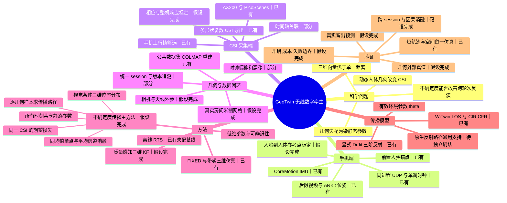
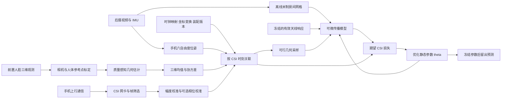
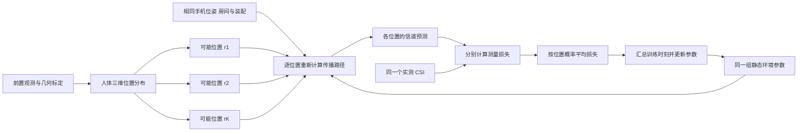
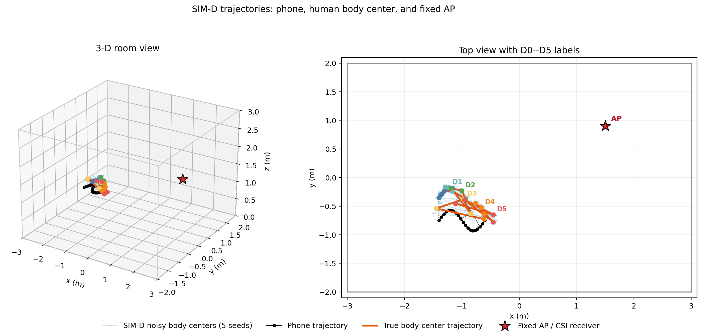
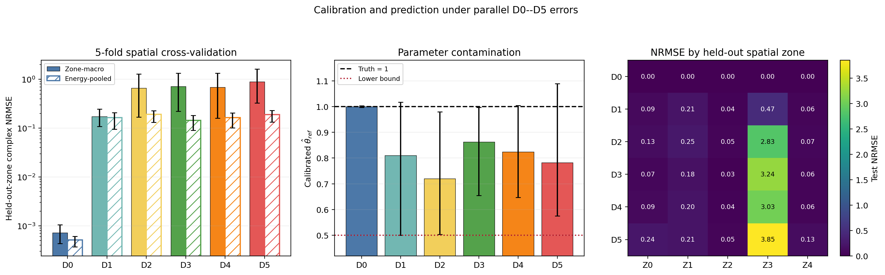

# GeoTwin: Propagating Front-Facing Geometry Uncertainty into RF Digital Twin Calibration

## 将前置人体几何不确定度传播到商用手机无线数字孪生校准

**MobiCom 风格论文初稿 · 结果假设版 · 不确定度传播修订**

作者与单位：待补充。GeoTwin 为本稿暂定系统名；底层 WiTwin/RFDT 平台归属原作者。

> **本稿的使用约定。** 按照作者“暂时假设所有结果都已经得到”的要求，正文将完整系统与核心实验写成已经完成的论文叙事，而非执行计划。现有报告中的数字保留真实来源；尚未提供的结果以 `【待填：指标】` 表示，其所在段落的正向结论属于写作假设，不代表当前已获得相应证据。第 6 节的既有仿真结果、第 7.2 节的既有工程结果是文档已有证据；第 7 节其余结果与完整方法实现按假设成立展开。本文不会把执行计划中的通过门槛当作测量结果。文末附有来源、状态和数值回填索引，便于后续核对。

## Abstract

Mobile RF measurements contain the effects of both the room and the operator carrying the device. If an inverse propagation model neglects changes in operator–phone geometry, it can absorb these changes into static environment parameters. Front-facing three-dimensional tracking provides a way to observe this geometry, but treating its estimates as exact leaves a second source of model mismatch: uncertainty in the geometry itself. We present GeoTwin, a commodity-phone system that propagates a calibrated distribution of operator geometry into RF digital twin calibration. GeoTwin obtains phone pose from rear-camera visual-inertial tracking and operator geometry from front-facing face tracking, while a commodity Wi-Fi NIC records phone-uplink CSI. For each CSI observation, it evaluates propagation at multiple plausible body positions and optimizes one shared set of environment parameters against the expected channel loss. This preserves geometry-dependent path changes and distinguishes uncertainty-aware calibration from fitting a single estimated position or an averaged complex channel. Existing controlled simulations establish the motivation: noisy three-dimensional geometry reduces held-out complex-channel NRMSE from 0.8861 to 0.0540 compared with fixed geometry, yet nominal parameter-interval coverage remains only 19.5%. In the completed-system scenario assumed by this draft, real-world evaluation further demonstrates improvements over point-estimate calibration in held-out prediction and cross-session parameter consistency. GeoTwin makes geometry uncertainty an explicit part of the calibration objective, with its benefits assessed separately from filtering, hardware calibration, and prediction averaging.

**Keywords:** RF digital twin; commodity Wi-Fi CSI; mobile sensing; differentiable ray tracing; human–device geometry; uncertainty propagation.

## 摘要

利用手机移动采集信道时，操作者相对手机的运动会改变传播路径；若模型忽略这些变化，反演算法可能将其错误地吸收到静态房间参数中。前置三维跟踪能够补充人体几何，但将有误差的位置估计当作精确输入，仍会留下几何失配。本文提出 GeoTwin，将经标定的人体位置分布传播到无线数字孪生的校准目标中。系统由后摄与 IMU 获取手机位姿，由前置人脸跟踪估计人体相对位置及协方差，并由商用网卡测量手机上行 CSI。对于同一个 CSI 观测，GeoTwin 在多个合理的人体位置上计算传播路径与信道损失，再以期望损失优化同一组静态环境参数。已有受控仿真表明，带噪三维观测将固定几何基线的留出复信道 NRMSE 从 0.8861 降至 0.0540，但对应参数区间的覆盖率仅为 19.5%，说明预测改善并不意味着几何误差已被充分处理。按本稿的完成态假设，真实实验进一步验证了不确定度传播相对单点输入的留出预测与跨 session 稳定性收益，并通过保持相同几何均值的消融，将该收益与滤波、硬件校准及测试时预测平均区分开。

## 1. Introduction

室内无线数字孪生将真实空间转化为可计算的传播模型，使系统能够预测未测位置的信道、解释环境变化，并支持通信与感知算法的调试。可微射线追踪进一步允许研究者利用无线测量校准材料、反射和天线响应参数，而不必逐项手工调节。Sionna RT 展示了传播模型对环境与设备参数求导的能力，RFDT 则将物理建模与逆渲染结合，为 RF 数字孪生提供了可优化的基础。[Sionna RT](https://arxiv.org/abs/2303.11103)、[RFDT](https://arxiv.org/abs/2603.18026)

这些能力为一种更易携带的采集方式创造了条件：研究者在房间中携带手机移动，后摄和惯性传感器记录位置、姿态与重建图像，手机产生正常上行通信，固定的 CSI 网卡测量无线信道。相对于需要专用发射设备的采集方式，这一路线可以复用手机已有传感器。但它同时引入一个容易被忽略的问题：**操作者随手机一起进入测量链路，并且人体与手机之间的关系不是常量。**

考虑手机经过同一位置、具有近似相同姿态的两次测量。第一次，人体位于手机侧后方；第二次，操作者调整手臂，使躯干进入手机到接收端的直达路径附近。房间墙面没有改变，但 CSI 可能发生明显变化。如果模型只知道手机的世界位姿，仍将人体放在一个固定位置，它只能通过改变墙面反射或其他静态参数解释差异。训练误差因此可能下降，而所得参数在另一条轨迹上失效。这个问题不是单纯提高优化器精度就能解决的，因为被优化的数据包含了未建模的动态原因。

本文研究的核心问题是：**手机自身的前置三维观测，能否将人体动态几何从静态环境参数校准中分离出来，并使校准结果泛化到未见轨迹和采集轮次？** 我们关注人体参考点相对手机有效 Wi-Fi 天线的三维向量，而不只关注距离。相同距离下，方向变化仍会改变人体是否遮挡直达路径、反射面是否可见，以及各路径的相位关系。

前置观测首先解决“人体几何未知”的问题，但还留下“人体几何不确定”的问题。例如，估计位置位于一条重要路径附近时，几何误差范围可能横跨遮挡边界：范围一侧存在直达路径，另一侧不存在。只在估计中心计算一次信道，会把其中一种传播状态当作确定事实。即使将轨迹平滑得更稳定，也不能回答这种残差究竟来自房间参数还是几何误差。

因此，本文的主要方法问题是：**如何使环境参数优化同时考虑几何估计及其可信范围，而不将这个范围内的变化全部解释成房间变化？** 难点在于，几何误差在无线域的影响取决于方向、手机姿态和当前传播路径。同样的位置方差，在一段轨迹上可能几乎不影响信道，在另一段轨迹上却可能改变路径是否存在。单个测距误差、固定 CSI 噪声项或只作用于残差大小的鲁棒损失，都没有显式表达这一联系。

GeoTwin 的核心是将三维几何分布贯穿到校准目标：先由前置观测和两级标定给出人体相对天线的位置及协方差；再在该分布下生成可能的人体位置，分别计算路径、信道和测量残差；最后平均这些损失，优化所有时刻共享的环境参数。手机位姿、房间几何和两端有效天线响应为这一过程提供固定条件。标定、滤波和多模态采集支撑方法运行，本文重点检验的是传播几何不确定度后，静态参数是否更能解释未见数据。

本文的贡献如下。

1. **揭示动态人体几何引起的静态参数混杂。** 通过同距离异方向、径向误差、空间留出和参数剖面对照，展示人体三维几何失配如何改变信道，并推动静态有效反射参数偏离真值。
2. **提出以几何期望损失为核心的环境参数反演方法。** 将视觉条件的三维位置分布通过路径求解传播到无线损失，解释其与单点条件输入、平均复信道的区别，并通过同均值、同数据、同预测规则的对照检验不确定度传播的独立作用。
3. **构建具有明确链路、时间与坐标语义的商用手机采集系统。** 将手机上行 CSI、多模态观测、装配标定和米制房间模型组织为可追溯数据集，支持对未见轨迹和 session 的统一评价。

我们的结论对象是给定频段、房间模型和受控装配下可泛化的**有效环境参数**。真实材料没有独立精确真值时，预测和重复性证据不能将这些参数自动解释为墙体介电常数。稳定器条件下的结果也不意味着任意自然手持都具有相同可靠性。

后文沿三个问题展开：第 2、6 节解释人体几何为什么会污染参数；第 4 节说明前置几何及其不确定度如何进入反演；第 7 节检验改善能否保持到留出轨迹与独立 session。系统采集和实现细节放在第 3、5 节，服务于这条证据链。

## 2. Background and Motivation

### 2.1 从无线预测到环境参数反演

前向模型根据场景和设备状态预测信道；反演则根据观测信道寻找能够解释数据的场景参数。后者要求模型将不同物理因素分开。如果墙体反射、天线方向性和人体位置都能产生相似残差，优化器即使收敛，也不一定恢复了正确原因。已有研究使用可微射线追踪学习材料、散射与天线参数，并在合成和真实室内信道测量上进行验证，为本文提供了方法基础。[Learning Radio Environments](https://arxiv.org/abs/2311.18558)

GeoTwin 研究移动采集中一个具体的混杂因素：操作者相对手机的动态三维几何。与静态房间几何不同，该状态逐时刻变化；与材料参数不同，它可以被手机前置传感器部分观测。将这类变量显式条件化，有机会减少静态参数承担的解释负担。

### 2.2 实际测量的是哪一条无线链路

手机连接 AP，并向实验接收服务发送上行流量。CSI 网卡监听这些手机发出的物理层帧，因此研究链路为：

```text
手机 Wi-Fi 发射端 ──无线传播──> CSI 采集网卡
       │
       └──经 AP 承载的 UDP 业务──> Linux 接收服务
```

AP 负责网络接入和业务转发；它的位置不能替代传播模型中的 CSI 接收天线位置。Linux 收到 UDP 数据报的时间也不是无线帧到达 CSI 网卡的直接真值。Wi-Fi 聚合、重传和监听采样意味着 UDP 数据报与 CSI PPDU 不存在机械的一一对应关系。

### 2.3 为什么三维几何是必要输入

令人体参考点相对手机天线的向量为 $\mathbf r_t$，距离为 $d_t=\|\mathbf r_t\|_2$。距离只约束一个球面，不能决定人体位于手机的哪一侧。在传播模型中，方位与俯仰不仅改变路径长度，还决定路径是否存在。因此，几何误差既可能造成连续相位扰动，也可能触发不连续的遮挡切换。

第 6 节的受控实验给出一个直接反例：即使给定精确距离，固定错误方向仍产生 0.835232 的测试复 NRMSE；使用正确三维几何时该值为 0.000613。这说明“测距足够准确”不等价于“传播几何足够准确”。

### 2.4 为什么不能只做平滑

平滑器依赖运动假设。在已有突变轨迹中，常速度 RTS 将测试三维误差从原始观测的 5.65 cm 增大到 28.30 cm。围绕错误平滑中心传播局部协方差，虽然略微改善信道预测，却没有消除参数偏差。因此，我们将几何均值质量与不确定度校准作为两个独立问题：前者控制系统性偏差，后者描述剩余误差。RTS 是使用未来视觉观测的离线参考，不是理论性能上界。

### 2.5 为什么测到几何以后仍要传播不确定度

考虑两次具有相同位置估计的前置观测：一次误差主要沿手机视线方向，另一次主要沿横向。它们的距离误差可能接近，但横向误差可能跨越遮挡边界，产生完全不同的信道变化。位置均值与一个标量误差条不能表达这种差别，三维协方差则保留误差的方向及各坐标间的相关性。

已有仿真也显示，RAW 显著改善预测以后，参数区间仍可能低覆盖。这使本文的目标分为两步：三维均值减少未观测几何造成的失配，几何分布进一步约束对剩余误差的拟合。后一项收益必须以 MARG 与使用同一均值的单点方法比较，不能由“深度方法优于固定人体”间接推出。

## 3. System Overview

### 3.1 当前工作系统思维导图

图 1 给出从当前工作区整理出的系统结构。`已有` 表示存在对应工程或仿真报告；`部分` 表示链路已通但计量标定或泛化证据不完整；`假设完成` 表示本稿按完成态展开、仍需实际结果回填。该状态说明只服务于初稿管理，不将计划中的模块误记为当前已验收模块。



**图 1：当前系统与论文完整方法的关系。** 前置三维观测用于约束操作者几何；后摄与 IMU 用于手机位姿和房间建模。CSI 是反演的无线观测，不能代替人体几何的独立真值。

### 3.2 端到端数据流



**图 2(a)：GeoTwin 数据流。** 几何估计在线产生，房间重建与静态参数反演离线执行。图中优化回路只使用训练 CSI；测试阶段保留视觉条件输入，但不通过测试 CSI 更新参数。

系统输出包括：每个有效 CSI 时刻的手机位姿、人体几何后验和质量信息；具有尺度与材料区域的房间模型；训练得到的参数及其不确定度；以及留出轨迹上的预测和失败诊断。每个输出都关联原始 session、时钟映射、坐标标定与硬件装配版本。

## 4. Propagating Geometry Uncertainty into RF Calibration

本节围绕一个目标组织：让静态环境参数面对一组由视觉证据支持的可能几何，而不是被迫精确拟合一个可能错误的人体位置。第 4.1–4.2 节定义变量并解释参数污染，第 4.3 节给出几何输入，第 4.4 节展开核心的不确定度传播，第 4.5–4.6 节说明优化约束与执行过程。

### 4.1 状态、坐标与观测模型

我们用 $\mathcal W$ 表示统一房间坐标，$\mathcal C$ 表示后摄坐标，$\mathcal A$ 表示手机有效发射天线坐标，$\mathcal F$ 表示人脸锚点坐标。变换 $T^X_Y$ 将 $Y$ 系中的齐次点转换到 $X$ 系。手机天线位姿为

$$
T^{\mathcal W}_{\mathcal A,t}
=T^{\mathcal W}_{\mathcal C,t}T^{\mathcal C}_{\mathcal A},
\qquad
\mathbf q_t=(\mathbf p_t,\mathbf R_t).
$$

令 $\mathbf b_t^{\mathcal F}$ 为根据人脸观测、头部姿态和标定参数估计的人体参考点，则其天线坐标为

$$
\begin{bmatrix}\mathbf r_t\\1\end{bmatrix}
=\left(T^{\mathcal W}_{\mathcal A,t}\right)^{-1}
T^{\mathcal W}_{\mathcal F,t}
\begin{bmatrix}\mathbf b_t^{\mathcal F}\\1\end{bmatrix}.
\tag{1}
$$

这一定义避免把人脸到相机的距离直接等同于人体到天线的距离。头部与躯干不是刚体，因此 $\mathbf b_t^{\mathcal F}$ 可以依赖头部姿态；其误差属于人体参考点标定不确定度。人体在房间中的参考位置为 $\mathbf p_{B,t}^{\mathcal W}=\mathbf p_t+\mathbf R_t\mathbf r_t$。已有阶段 1 仿真中的相对向量按世界轴表达，接入本模型时必须先转换坐标，不能直接与天线局部向量混用。

我们记完整 CSI 为 $\mathbf s_t\in\mathbb C^{M_t}$，其中 $M_t$ 由子载波、接收链和空间流共同决定。不同 CSI 形状分别分组；未观测分量不参与损失。前向模型为

$$
\widehat{\mathbf s}_t
=F_{\theta}(\mathbf q_t,\mathbf r_t,
\boldsymbol\beta_0,\mathbf a_0;\mathbf c),
\tag{2}
$$

其中 $\theta$ 是静态环境参数，$\boldsymbol\beta_0$ 是控制实验中的人体形状与电磁代理属性，$\mathbf a_0$ 是冻结的两端装配，$\mathbf c$ 包含频率、带宽、接收位置和天线配置。我们用 $\mathbf R_t$ 表示旋转，以 $\Sigma_t^z$ 表示观测噪声协方差，避免混用原计划中的同名符号。

对单个子载波和收发通道，其有效信道可写为

$$
\widetilde H_{k,t}
=C_{k,j}
\sum_{\ell\in\mathcal P_t}
G_{\rm rx}(\Omega^{\rm rx}_{\ell};\mathbf a_0)
\alpha_{\ell}(\theta,\mathbf q_t,\mathbf r_t)
G_{\rm tx}(\Omega^{\rm tx}_{\ell};\mathbf a_0)
e^{-\mathrm j2\pi f_k\tau_{\ell}}+n_{k,t}.
\tag{3}
$$

$C_{k,j}$ 表示第 $j$ 个 session 经约束的射频链响应。式 (3) 是受控校准后的模型，不表示未校准 CSI 的全部误差都能由一个固定复系数描述。方向图按每条路径转换到对应装配局部坐标后查询，且不与 $\theta$ 无约束地共同优化。

### 4.2 几何错误为何会污染静态参数

将复 CSI 拆成实部与虚部，或取经过校准的幅度，得到实值观测向量 $\mathbf y$。在真值附近且路径可见性不变的局部区域内，将模型线性化：

$$
\mathbf f(\theta^*+\delta\theta,\mathbf r^*+\delta\mathbf r)
\approx\mathbf f(\theta^*,\mathbf r^*)
+J_{\theta}\delta\theta+J_r\delta\mathbf r.
$$

假设观测为 $\mathbf f(\theta^*,\mathbf r^*)+\boldsymbol\epsilon$，模型却使用偏移几何 $\mathbf r^*+\delta\mathbf r$。若 $J_\theta^\top WJ_\theta$ 可逆，加权最小二乘的参数偏移近似为

$$
\delta\widehat\theta
\approx
-(J_\theta^\top WJ_\theta)^{-1}J_\theta^\top WJ_r\delta\mathbf r
+(J_\theta^\top WJ_\theta)^{-1}J_\theta^\top W\boldsymbol\epsilon.
\tag{4}
$$

第一项给出几何失配到静态参数的局部投影。当两类变量产生的信道变化方向相似时，几何误差会被参数吸收。若矩阵病态，较小的几何失配也可能引起较大的参数变化。即使几何误差均值为零，有限轨迹、非线性和遮挡切换仍可能产生偏差。式 (4) 不覆盖路径出现或消失的位置；我们通过重新求解路径和受控实验评价这些情况，而不将局部推导外推为全局保证。

### 4.3 前置三维观测驱动的人体—手机几何估计

本模块为射线追踪提供人体相对手机的动态三维位置及其不确定度。后摄与 IMU 给出手机在房间中的六自由度位姿 $\mathbf q_t$；前置三维跟踪补充操作者相对手机的几何 $\mathbf r_t$。二者描述不同的运动量：即使手机位姿已知，操作者伸缩手臂、转身或改变手机高度时，人体相对手机的位置仍可能变化。我们先利用前置观测独立估计这一状态，再将其输入第 4.4 节的环境参数反演；主方法不使用 CSI 反向修正人体轨迹，以免重新引入 $\mathbf r_t$ 与 $\theta$ 的混淆。

**从前置人脸锚点获得三维观测。** 系统采用 ARKit 世界跟踪与用户人脸跟踪并发的采集路线，记录同一 ARSession 中的相机位姿、人脸锚点变换、测量时间及跟踪标志。对同一测量时刻，先通过相机世界位姿的逆变换将人脸锚点转换到相机坐标系，保留其三维位置。当前采集文件中的 `face_distance_m` 是人脸锚点中心与 ARKit 后置相机参考点之间的距离；它只是原始观测的派生量，既不是前摄光心到胸腔的直接测距，也不是模型需要的天线—人体距离。人体几何由完整的三维变换计算，不从该标量距离恢复方向。主采集路线使用人脸锚点，不依赖额外导出原始前置深度图。

**将人脸位置换算为人体模型参考点。** 我们采用相机—Wi-Fi 天线外参与人脸—胸腔参考点两级标定，将上述观测转换为式 (1) 定义的天线坐标系三维向量。第一阶段固定实验人员与手机—保护壳—夹具—稳定器装配，以固定三维偏移作为人脸—胸腔标定的简单基线，并用侧拍测距或外部深度观测评价不同距离、手机高度和头部姿态下的误差。头部与躯干并非刚体，该偏移是受控姿态范围内的近似，不能被解释为准确追踪了人体电磁反射中心。带头部姿态的映射属于简单标定不足时的增强方案，不是本模块预设的必要组件。

将经过标定、尚未进行时间滤波的人体三维观测记为 $\mathbf z_t$：

$$
\mathbf z_t=\mathbf r_t+\mathbf v_t,
\qquad \mathbf v_t\sim\mathcal N(\mathbf 0,\Sigma_t^z).
\tag{5}
$$

这里 $\Sigma_t^z$ 描述标定后几何观测的随机误差近似，其尺度由独立几何标定数据确定。未消除的固定偏差需单独报告；人体形状、衣物和电磁属性造成的 $w_{\rm human}$ 也不由这一观测噪声模型统一解释。经标定的 $\mathbf z_t$ 本身构成 DEPTH-RAW 基线，用于检验后续时间处理是否确有收益。

**用三维 KF 处理观测噪声与短时丢失。** 在线处理采用项目计划中的三维常速度卡尔曼滤波。状态同时保留相对位置和相对速度，并根据相邻测量时间构造转移矩阵：

$$
\begin{aligned}
\mathbf x_t&=[\mathbf r_t^\top,\dot{\mathbf r}_t^\top]^\top,\\
\mathbf x_t&=A_t\mathbf x_{t-1}+\mathbf u_t,
& A_t&=\begin{bmatrix}I_3&\Delta t_t I_3\\0&I_3\end{bmatrix},\\
\mathbf z_t&=H\mathbf x_t+\mathbf v_t,
& H&=[I_3\ \ 0],\qquad \operatorname{Cov}(\mathbf u_t)=Q_t.
\end{aligned}
\tag{6}
$$

$Q_t$ 表示相对运动偏离短时常速度近似的程度。按照项目的自适应处理路线，手机 IMU 的加速度和角速度为运动强度及 $Q_t$ 的设置提供辅助信息；它们不直接测量躯干运动，也不被积分为人体相对位置。观测协方差 $\Sigma_t^z$ 则依据人脸跟踪状态与标定得到的观测误差设置。两类噪声的具体参数通过独立几何实验确定，不能由 CSI 拟合残差反向调节。

质量控制先检查人脸 ID、跟踪标志、时间戳和物理范围，再结合三维观测序列的异常检测及 KF 创新检查标记可疑样本。项目中的 Hampel/MAD 和归一化创新平方（NIS）是异常检测候选，不能仅凭一次较大创新就认定发生了真实动作或传感器错误。当前人脸锚点格式没有逐像素深度有效率或深度 ROI 的 MAD，因而不将这些原始深度图专属量写成现有输入。人脸跟踪丢失时，滤波器只预测、不更新，并保留缺失标志；上一帧观测不冒充当前测量。

**输出三维几何及其不确定度。** 令 $C_t$ 为六维状态的滤波协方差，供反演使用的位置协方差为 $P_t=HC_tH^\top$。人体—手机距离和距离方差由三维状态派生：

$$
\widehat d_t=\|\widehat{\mathbf r}_t\|_2,
\qquad
\sigma_{d,t}^2\approx
\frac{\widehat{\mathbf r}_t^\top P_t\widehat{\mathbf r}_t}
{\|\widehat{\mathbf r}_t\|_2^2}.
$$

系统保留原始观测、滤波后的 $\widehat{\mathbf r}_t$、$P_t$、派生距离、测量时间、跟踪与缺失标志，以及所用标定版本。经第 5.3 节的时间映射对齐后，$\widehat{\mathbf r}_t$ 确定射线追踪中的人体位置，$P_t$ 为几何采样提供不确定度；$\widehat d_t$ 用于测距评价和标量消融，不能替代三维输入。

离线对照使用相同状态与噪声模型执行 RTS 后向平滑，输出对应的三维轨迹和协方差。RAW、在线 KF 与离线 RTS 分别通过外部几何真值和留出 CSI 评价，不能预设平滑一定优于原始观测。该模块的作用是产生可追溯、带不确定度的几何输入；本文的方法贡献集中在下一节如何利用这些输入约束静态环境参数反演。

### 4.4 核心方法：从人体位置分布到无线反演损失

DEPTH-KF 为每个时刻给出一个人体位置估计。DEPTH-MARG 进一步询问：**在这次观测允许的位置误差范围内，哪些传播状态都有可能发生，同一组房间参数能否在这些状态下保持较小的平均预测损失？** 这里的“不确定度传播”包含两个连续步骤：先将人体位置分布通过射线追踪变成信道预测分布，再将这个分布带入静态参数的优化目标。只保存一个协方差数值，或只在最终 CSI 上加入独立噪声，都没有完成这两个步骤。



**图 2(b)：不确定度传播的核心计算。** 不同样本表示同一时刻可能的人体位置，不是多个同时存在的人体，也不是多次独立无线测量。所有几何样本使用同一组 $\theta$，只有训练 CSI 进入更新回路。

#### 4.4.1 输入分布：保留误差大小、方向与相关性

我们沿用项目计划中的三维高斯近似，以第 4.3 节的滤波位置和位置协方差构造视觉条件分布。为区分滤波器原始输出与校准后的分布，记

$$
\widetilde P_t=\gamma P_t,
\qquad
p_t^{(0)}(\mathbf r\mid\mathcal Z_t)
=\mathcal N(\widehat{\mathbf r}_t,\widetilde P_t),
\tag{7}
$$

其中 $\mathcal Z_t$ 表示该方法可使用的视觉观测和固定标定信息；主方法使用因果 KF，离线 RTS 对照可使用同一轨迹内的未来视觉帧。$\gamma>0$ 是可选的协方差尺度校准量，默认是否需要校准及其数值均由独立几何开发数据确定，不能根据训练或测试 CSI 的残差自由优化。

协方差的特征向量给出误差椭球的主方向，特征值给出各方向上的方差。完整 $\widetilde P_t$ 可以表达斜向相关误差；用对角矩阵替代会丢掉这种相关性，用一个距离方差替代则进一步丢掉切向误差。均值和协方差必须处于同一天线坐标系。在手机位姿固定的条件下，将分布旋转到房间坐标时，其协方差为 $\mathbf R_t\widetilde P_t\mathbf R_t^\top$，不能只旋转位置而保留原协方差方向。

滤波协方差是模型输出，不天然等于实际误差。我们用外部人体参考点真值检查覆盖率，并同时报告区间大小：过小的范围会漏掉真实位置，过大的范围虽然容易获得高覆盖，却可能包含大量不符合实际的传播状态。头身映射的持续偏差单独校正；硬件与材料失配不并入 $P_t$。本节在已标定手机位姿、时间映射和装配条件下处理人体几何，其他误差的影响通过对应消融评价。

人体代理必须满足几何可行性，例如不能把手机放入人体盒体内部。为明确概率语义，本稿采用在预设可行域 $\mathcal R_t$ 内条件化的分布 $p_t(\mathbf r)\propto p_t^{(0)}(\mathbf r)\mathbb 1[\mathbf r\in\mathcal R_t]$。截断会改变实际均值和协方差，故同时保存其样本统计与接受比例；以下计算以实际 $p_t$ 为准。该约束来自场景几何，不按 CSI 拟合好坏选取样本。

#### 4.4.2 第一次传播：人体位置误差如何变成信道误差

为统一幅度与复数实验，定义观测算子 $\phi$：真实幅度主线取 $\phi(\mathbf s)=|\mathbf s|$；已校准的复数实验将实部、虚部堆叠为实向量。记

$$
\mathbf y_t=\phi(\mathbf s_t),
\qquad
\mathbf f_t(\theta,\mathbf r)
=\phi\!\left(F_\theta(\mathbf q_t,\mathbf r,
\boldsymbol\beta_0,\mathbf a_0;\mathbf c)\right).
$$

设实际几何分布的均值和协方差为 $\boldsymbol\mu_t^r$、$V_t^r$；没有可行域截断时，它们分别等于 $\widehat{\mathbf r}_t$、$\widetilde P_t$。在路径集合不变、模型局部光滑且不确定度较小时，有

$$
\begin{aligned}
\mathbf f_t(\theta,\mathbf r)
&\approx\mathbf f_t(\theta,\boldsymbol\mu_t^r)
+J_{r,t}(\mathbf r-\boldsymbol\mu_t^r),\\
\Sigma^{\rm geo}_{y,t}
&\approx J_{r,t}V_t^rJ_{r,t}^\top,
\qquad
J_{r,t}=\left.\frac{\partial\mathbf f_t}{\partial\mathbf r}\right|_{\boldsymbol\mu_t^r}.
\end{aligned}
\tag{7a}
$$

式 (7a) 解释了为什么只看几何 MAE 不够：同一个位置误差分布，经不同位置的传播敏感度 $J_{r,t}$ 映射，会产生不同的信道误差。一个共同的人体位置扰动还会同时影响多个子载波和接收链，产生相关的无线变化。因此，独立地向每个 CSI 分量加高斯噪声，通常不等价于传播同一个三维几何分布。输入协方差经模型变换到输出协方差，是多变量不确定度传播的标准思想；此处的特定问题是无线路径对人体几何的敏感性。[JCGM 102](https://www.bipm.org/en/doi/10.59161/jcgm102-2011)

在遮挡边界附近，局部线性化可能失效：同一位置分布中的不同点具有不同路径集合。GeoTwin 因而采用计划中的几何采样路线，而不是要求所有样本沿用均值处的路径或以式 (7a) 代替完整求解。对基础高斯分布，可构造

$$
\mathbf r_t^{(k)}=\widehat{\mathbf r}_t+L_t\boldsymbol\epsilon_t^{(k)},
\quad L_tL_t^\top=\widetilde P_t,
\quad \boldsymbol\epsilon_t^{(k)}\sim\mathcal N(\mathbf0,I_3).
\tag{7b}
$$

主稿用拒绝不满足可行域的候选来获得 $p_t$ 的样本，并记录拒绝情况；不将投影后的样本误称为同一个截断高斯分布。每个接受样本对应房间中的人体位置 $\mathbf p_t+\mathbf R_t\mathbf r_t^{(k)}$。求解器在该位置下重新判断可见路径，随后得到 $\mathbf f_t^{(k)}(\theta)$。**同一个几何样本用于该时刻全部子载波与通道**，从而保留它们由共享几何引起的关联。通过逐样本运行模型获得输出分布，也是标准 Monte Carlo 分布传播的做法；采样本身并非本文的新贡献。[JCGM 101](https://www.bipm.org/en/doi/10.59161/jcgm101-2008)

样本可以估计预测均值、方差与分位区间，但输出未必是高斯分布。例如，遮挡和无遮挡样本可能形成不同的预测群。我们保留这些样本用于损失计算，不强制用一个输出高斯近似替代它们。式 (7a) 仅帮助解释和检查光滑区域的敏感度，不要求当前后端已经支持对人体位置求导。

#### 4.4.3 第二次传播：用几何期望损失更新同一组环境参数

给定一个几何样本，真实幅度主线的测量损失为

$$
\ell_t(\theta,\mathbf r)
=\sum_{k\in\mathcal V_t}w_{t,k}
\rho\!\left(
\frac{|s_{t,k}|-|F_{\theta,k}(\mathbf q_t,\mathbf r,\ldots)|}
{\sigma_{A,k}}
\right).
\tag{8}
$$

$\mathcal V_t$ 为有效通道集合，$\sigma_{A,k}$ 来自独立校准段，$w_{t,k}$ 和损失函数对各方法保持一致。为隔离不确定度传播，核心对照采用同一平方损失；鲁棒损失作为另一个正交消融，不与 MARG 的引入同时改变。

单点方法仅计算 $\ell_t(\theta,\widehat{\mathbf r}_t)$。DEPTH-MARG 对视觉支持的可能几何计算期望：

$$
\widehat\theta_{\rm MARG}=
\arg\min_{\theta\in\Theta}
\sum_{t\in\mathcal D_{\rm train}}
\underbrace{\mathbb E_{\mathbf r\sim p_t}
[\ell_t(\theta,\mathbf r)]}_{\text{同一测量在可能几何下的期望损失}}
+\lambda\mathcal R(\theta).
\tag{9}
$$

用 $K$ 个等权样本计算时，目标及其参数梯度为

$$
\begin{aligned}
\widehat L_K(\theta)
&=\sum_t\frac1K\sum_{k=1}^K
\ell_t(\theta,\mathbf r_t^{(k)})+\lambda\mathcal R(\theta),\\
\nabla_\theta\widehat L_K
&=\sum_t\frac1K\sum_{k=1}^K
\nabla_\theta\ell_t(\theta,\mathbf r_t^{(k)})
+\lambda\nabla_\theta\mathcal R(\theta).
\end{aligned}
\tag{9a}
$$

这一步让静态参数接受多个可能传播状态的共同约束。某个参数更新若只降低估计中心处的损失，却使其他有较高概率的位置预测变差，其优势会在平均损失中减弱。反之，在视觉支持的几何范围内均能维持较小损失的参数更符合该目标。这里优化的是平均风险，不要求每个样本都精确拟合同一个 CSI，更不为每个位置单独求一组 $\theta$ 后再平均。

式 (9a) 中的 $1/K$ 不可省略，否则增加采样数会改变数据项与正则项的比例，导致不公平比较。$K$ 表示数值积分预算，不增加独立实验样本数。训练数据、初始化、参数边界和正则项均与单点基线一致；几何均值和协方差固定在视觉侧，CSI 只更新静态参数。

#### 4.4.4 为什么“先平均信道”不能替代“先计算损失”

不确定度传播中有三个容易混淆的计算：

- **单点输入：** 在一个位置估计上计算信道和损失，忽略位置分布。
- **平均预测：** 对可能几何的预测先平均，再与测量计算损失，拟合预测分布的中心。
- **期望损失：** 每个几何分别与同一测量计算损失，再平均，同时考虑分布中心与预测的分散程度。

对固定的半正定权重 $W_t$ 和平方损失，这一区别具有精确表达：

$$
\mathbb E_{p_t}\|\mathbf y_t-\mathbf f_t\|_{W_t}^2
=\|\mathbf y_t-\boldsymbol\mu_{y,t}\|_{W_t}^2
+\operatorname{tr}(W_t\Sigma^{\rm geo}_{y,t}),
\quad
\boldsymbol\mu_{y,t}=\mathbb E_{p_t}\mathbf f_t.
\tag{10}
$$

右侧第二项是可能几何产生的预测分散度，它通常随 $\theta$ 改变。在局部光滑区域，该项约为 $\operatorname{tr}(W_tJ_{r,t}V_t^rJ_{r,t}^\top)$。这说明式 (9) 将几何方向与无线敏感度共同带入优化，而不是给一个“几何噪声大”的时刻简单乘上较小权重。相较于仅拟合均值，它会惩罚对当前几何不确定方向过度敏感的参数选择。恒定、与参数无关的分散度项则不会改变最优参数；不能仅因 $P_t\ne0$ 就断言 MARG 必然有收益。

在幅度主线中，必须先求每个复信道的幅度，再执行上述步骤，因为 $|\mathbb E H|\ne\mathbb E|H|$。已有阶段 1 的七点方法先平均复 CFR，本文保留为 **CFR-MEAN**；新增的同域均值对照称为 **PRED-MEAN**，主方法则为先损失后平均的 **DEPTH-MARG**。三者使用同一批几何样本，才能检验目标函数差异，而不是采样差异。

式 (9) 严格沿用项目计划的期望风险定义。它不是 $-\log\mathbb E[p(\mathbf y_t\mid\theta,\mathbf r)]$ 所定义的边缘负对数似然，也不直接给出参数的贝叶斯后验。附录 B 给出两者的差别和本方法的适用边界，以免把“边缘化”一词当作无偏恢复保证。

#### 4.4.5 计算、梯度与留出预测

优化前生成并保存几何样本及随机种子，在不同参数迭代和初始化间复用。这样参数梯度的变化主要来自 $\theta$，而不会在每一步混入全新的采样扰动；最终通过独立随机种子检查有限采样结果的稳定性。数值积分点可作为开销对照，但节点和权重必须与所近似的分布匹配，不能将任意七点等权平均自动视为高斯积分。

对第 4.5 节的有效反射增益参数，每个几何样本的逐阶路径基可预先计算，随后在这些固定基上求 $\theta$ 的梯度。该流程只需要对目标参数求导，不需要对人体坐标反向传播。若更换为影响路径结构的参数，缓存和求导假设必须重新审计。$K$、几何接受率、求解耗时和梯度误差一起报告；降低开销不能以固定均值路径、从而漏掉样本遮挡变化为代价。

留出阶段冻结 $\widehat\theta$，仅用留出轨迹的视觉输入生成几何分布。对于平方幅度误差，MARG 的点预测取该分布下的平均幅度，即 $K^{-1}\sum_k|F_{\widehat\theta}(\mathbf q_t,\mathbf r_t^{(k)},\ldots)|$，同时保留其几何条件预测分散度。该分散度不是包含全部硬件噪声和模型失配的完整预测区间。

平均预测本身可能改善测试误差，因此不能把所有收益都归于参数训练。第 7.5 节额外执行“训练目标×测试预测规则”的交叉对照：单点与 MARG 训练所得参数，分别用同一个 KF 位置预测、或用同一个几何分布平均预测。在相同测试规则下比较两组参数，才能判断期望损失是否真正改善了环境校准。

#### 4.4.6 三种不确定度及方法边界

本文区分三个对象：$P_t$ 描述人体位置的不确定度；$\Sigma^{\rm geo}_{y,t}$ 描述它经传播模型引起的信道分散；独立轨迹和 session 反演得到的参数分布，描述环境估计的重复性。前两者都不能直接当作 $\theta$ 的置信区间。真实结果通过完整轨迹/session 重采样并重新反演评估参数变异，有材料或仿真真值时再评价覆盖率。

各时刻几何误差可能相关。对式 (9) 的逐时刻可加损失，期望的线性性允许用各时刻边缘分布计算目标，而不要求人体轨迹在时间上独立。但在分析参数区间或生成整段扰动轨迹时，独立逐帧采样不能替代联合时间分布；共享外参偏差也不能通过对每帧重新抽样“平均掉”。

当 $P_t$ 趋于零且均值位于可行域内时，MARG 退化为同均值的单点方法。随着不确定度增大，期望损失会更重视预测分散度，但也可能偏好较弱反射等低敏感度参数。因此，合理协方差不能保证参数无偏，更大的协方差也不保证更好结果。均值偏差、错误头身映射和严重传播模型失配需要各自处理。本文将收益限定为受控条件下的留出预测和参数稳定性改善，并用相同均值、协方差尺度、方向和采样预算的消融验证这一结论。

### 4.5 参数约束、硬件校准与可辨识性

第一层验证仅估计 1–2 个低维有效环境参数。对已有仿真，WiTwin 提供各反射阶的路径基 $H_b$，我们使用

$$
H(\theta_{\rm ref},\mathbf r)
=\sum_{b=0}^{3}\theta_{\rm ref}^{b}H_b(\mathbf r),
\quad\theta_{\rm ref}\in[0.5,1.5].
\tag{11}
$$

该参数是基准物理材料上的逐反射增益校正，不能解释为材料介电常数。若扩展到材料区域参数，必须重新执行梯度与可辨识性检查。

系统先使用独立参考数据固定两端有效方向性和频率响应，再估计环境参数。每个 session 仅允许事先规定、由参考段约束的低维慢变校正，不为每个 CSI 包引入自由复增益。训练过程中保存多初始化终点、参数边界命中、损失剖面、归一化 Jacobian 奇异值和异常梯度。

对不可辨识的数据，系统输出失败标志和预测残差，而不输出带有过强物理含义的材料估计。增加参数维度不是默认改善；只有独立开发数据提供足够激励，才扩展参数集合。

### 4.6 算法流程

```text
输入：训练 CSI、对应手机位姿、视觉几何均值与协方差、房间和装配标定
输出：一组有效环境参数 theta、几何条件预测分布、反演审计结果

准备：
  固定训练/开发/留出划分，以及仅由几何开发数据确定的协方差设置。
  对每个有效 CSI 时刻，生成 K 个可行人体位置，保存种子和接受比例。
  将每个位置变换到房间坐标，逐样本求解路径；允许样本间路径集合不同。

反演：
  对每个相同的参数初始化，重复：
    1. 以当前 theta 计算每个几何样本在全部有效通道上的预测。
    2. 每个预测分别与该时刻同一个 CSI 计算损失。
    3. 对 K 个损失取平均，再汇总训练时刻并加入相同正则项。
    4. 对共享 theta 求梯度并更新；不更新视觉均值、协方差或人体样本。
  检查多初始化终点、参数边界、损失剖面及有限差分梯度。

评价：
  冻结 theta，用留出视觉几何做条件预测，不使用留出 CSI 更新任何参数。
  在相同测试预测规则下比较 KF 与 MARG 校准结果。
  以独立轨迹/session 为单位统计误差、参数稳定性与失败率。
```

对同一参数化，所有基线使用相同优化器、训练样本、初始化与停止条件。额外计算来自几何采样，不来自为主方法提供更多调参机会。

## 5. Implementation

### 5.1 手机采集前端

手机端基于 iPhone 11 Pro 的原生应用 WiTwinRecorder。后摄 ARSession 提供图像和世界跟踪，前置能力提供人脸锚点，CoreMotion 提供惯性数据；后置视频、人脸记录和发包日志在同一进程中维护。Apple 提供世界跟踪与用户人脸跟踪的组合接口，但接口支持本身不等价于人体参考点精度保证。[Apple ARKit](https://developer.apple.com/documentation/arkit/combining-user-face-tracking-and-world-tracking)

系统保存传感器测量时间和回调时间，后者仅用于延迟诊断。成功写入视频的帧获得连续视频索引，写入失败的样本保留失败标记，从而避免“视频帧号连续”等同于“无丢帧”的错误判断。人脸锚点与 ARFrame 保持逐样本对应，原始观测和后处理几何分别存储。

我们的主路径使用三维人脸锚点。它不要求把原始前置深度图与后摄视频同时导出，也不将锚点距离称作直接胸腔深度。此处“前置深度增强”指借助前置三维跟踪约束人体几何。

### 5.2 CSI 接收、筛选与幅相策略

接收端使用 AX200 和 PicoScenes，保留源地址、帧方向、信道、PHY 配置、RSSI、设备时间及复 CSI。PicoScenes 提供商品 Wi-Fi 的测量能力，但具体硬件的字段、响应和采样密度由本系统实际记录验证，不能沿用其他网卡的标称采样率。[PicoScenes](https://arxiv.org/abs/2010.10233)

主实验使用冻结频段和带宽，并按手机源地址及数据帧语义筛选上行。不同空间流和 CSI 形状分别处理；没有直接混合为一个固定长度的“纯传播向量”。系统保留射频链、空间流及可用 PHY 元数据，只在发射模式可解释的分组内比较；无法确认预编码或等效通道映射的组不用于物理参数反演。

幅度是跨全部真实实验的主评价量。相位经过独立校准与重复性验证后，才在预先确定的可用子集内报告复数或相位结果。相位筛选规则在测试前冻结，并报告被排除的比例，避免仅保留最稳定片段形成选择偏差。

### 5.3 时间映射与不确定度

我们用仿射映射联系手机单调时钟与 CSI 设备时钟：

$$
t_{\rm csi}=a\,t_{\rm phone}+b,
\qquad
\widehat t_{\rm phone}=(t_{\rm csi}-b)/a.
\tag{12}
$$

Linux 内核时间作为桥接观测。拟合同时保留偏移、漂移、残差、适用时间和可靠性标志。有效跨度不足时不强行估计漂移，而是记录受限映射并在评价中区分。

在映射后的 CSI 时刻，系统对平移和旋转分别进行合适插值，并查询人体状态。ARKit 最近帧间隔只表示离散采样关联程度，不能直接称为跨设备同步精度。若映射时间误差方差为 $\sigma_t^2$，在局部线性且与几何误差独立的近似下，人体位置额外协方差为

$$
P_{t,\rm align}\approx
\dot{\mathbf r}_t\dot{\mathbf r}_t^\top\sigma_t^2.
\tag{13}
$$

手机位姿插值误差另行评价；共享时钟误差引起的相关项在完整误差预算中保留。高速度或长缺失区间不能仅靠式 (13) 补偿，因此系统同时输出关联质量和不可用区间。

### 5.4 房间重建与传播后端

iPhone 11 Pro 没有后置 LiDAR。GeoTwin 使用后置视频、ARKit 位姿和 COLMAP 的 SfM/MVS 构建离线几何，经 Sim(3) 对齐获得米制尺度，并对主要墙面、地面和天花板作平面规整和材料分区。COLMAP 提供通用重建能力；传播模型仍需独立验证尺度、法向与关键表面位置。[COLMAP](https://colmap.github.io/)

路径计算基于项目固定版本的 WiTwin/Channel 与显式 DrJit 反射后端，研究模型包含 LOS 和最多三次镜面反射。所有几何样本保留路径数、反射阶和截断信息。我们不将显式后端的实验结果表述为上游原生 reflected EPC 已经通用通过，也不声称三次镜面反射覆盖完整电磁传播。

对式 (11)，每个几何样本的逐阶路径基可在优化前缓存，优化期间只更新低维反射增益；该加速不适用于任意会改变路径结构的材料或几何参数。新增参数必须按实际求导位置报告梯度检查，不能沿用缓存校正层的结果。

### 5.5 复现与运行边界

每个 session 保存原始数据、输入输出校验和、采集配置、装配编号、时钟映射、坐标变换和处理版本。实验划分按独立轨迹与 session 固定，所有方法读取同一份划分。外参、滤波和协方差校准只使用训练侧或独立开发数据。

采集时只承担传感器记录与在线状态估计；重建和反演在外部计算平台执行。本文分别报告采集实时性和离线优化耗时，不将两者合并为“手机实时无线数字孪生”。

不确定度传播另行保存输入坐标系、原始与校准后协方差、几何采样数、种子、可行域规则、样本接受率和各样本路径摘要。实验记录明确标识损失在幅度还是复数域计算、平均发生在预测前还是损失后，以及梯度是否使用路径基缓存。这些信息决定 MARG、PRED-MEAN 和 CFR-MEAN 是否真正执行了可比较的计算，而不仅是使用相似的方法名称。

对 $T$ 个时刻、每时刻 $K$ 个几何样本，直接方案需要约 $TK$ 次几何前向求解，拒绝采样还带来候选生成成本。若目标参数允许缓存逐阶路径基，几何求解成本在迭代前支付，之后的优化仅更新参数相关系数；更一般的参数化则不能沿用这一成本估计。报告分别列出路径准备、参数优化和测试预测时间，避免把昂贵的预计算排除后声称主方法几乎没有额外开销。

## 6. Controlled Simulation: Geometry Causes Parameter Bias

本节数字来自已有实验报告和结果文件。我们先回答几何是否构成可检测的混杂因素，再讨论完整系统方法；同一仿真器生成与反演的结果不替代真实世界验证。

### 6.1 实验设置

短轨迹场景为 $6\times4\times3\,\mathrm m$ 房间，具有六个主要边界表面和一个 $0.22\times0.30\times1.70\,\mathrm m$ 人体盒体。人体尺寸、材料和朝向固定，只改变其中心位置；因此该实验隔离人体几何，未模拟衣物、四肢与个体电磁差异。发射与接收端均为单单元 dipole，载频为 2.4 GHz，带宽为 20 MHz，计算 64 个等间隔频点；这些是模拟频率采样，不等同于 AX200 导出格式。

20 个离散时刻中，前 16 个用于参数校准，后 4 个为具有几何突变的留出段。比较组共用相同动态观测与配对的 30 dB CSI 噪声。每组执行 200 次 CSI 噪声重复；含噪几何使用 5 个独立种子，径向、方位和俯仰噪声标准差分别为 4 cm、6° 和 3°。200 次噪声重复不代表 200 条独立轨迹。测试误差相对于无噪声合成信道计算，因此 oracle 可低于含噪测量本身的误差水平。



**图 3：已有短轨迹仿真场景。** 旧图中的 AP 标记在本实验中对应固定信道接收端；真实采集拓扑仍以图 2 中的 CSI 网卡为接收端。D0–D5 是这一轨迹的分段标签。

### 6.2 三维几何改善预测并减少参数偏差

**表 1：短轨迹已有仿真结果。** $\theta^*_{\rm ref}=1$；最后一列为命中 0.5 下界的比例。STATIC 使用独立静态控制观测，其余方法使用相同动态观测。

| 方法／原组号      | 模型人体几何       | 测试复 NRMSE | 平均参数绝对误差 | 下界命中率 |
| ----------------- | ------------------ | -----------: | ---------------: | ---------: |
| STATIC / SIM-A    | 静态真值           |     0.000489 |         0.002799 |         0% |
| FIXED / SIM-B     | 固定三维向量       |     0.886097 |         0.500000 |       100% |
| ORACLE-3D / SIM-C | 动态三维真值       |     0.000613 |         0.002339 |         0% |
| DEPTH-RAW / SIM-D | 带噪三维向量       |     0.054018 |         0.038535 |         0% |
| SCALAR / SIM-G    | 真值距离、固定方向 |     0.835232 |         0.500000 |       100% |

FIXED 将有效反射增益推到下界，表明优化器试图通过减弱反射解释错误几何。然而其留出误差仍然很高，说明全局反射增益不能修复路径层面的失配。ORACLE-3D 使参数恢复至真值附近；DEPTH-RAW 在存在明显几何噪声时仍将测试 NRMSE 降低 93.90%。SCALAR 具有近乎零距离误差，却仍有较大三维误差和预测残差，提供了距离不足的直接证据。

我们同时检查预测收益和参数区间。已有 RAW 的参数区间覆盖率仅为 19.5%，而 ORACLE-3D 为 96.5%。这一差异说明：深度可显著降低预测误差，但忽略几何不确定度的区间仍可能过度自信。该现象为后续完整系统的协方差传播提供动机，而不是已经证明所有不确定度方法有效。

### 6.3 失配平滑与平均 CFR 的反例

**表 2：已有时间处理基线。** 这里的 RTS 是原常速度设置；CFR-MEAN 是原 SIM-F 的七点复信道均值，不是本文式 (9) 的 DEPTH-MARG。

| 方法                        |     测试三维位置误差/m | 测试复 NRMSE | 平均参数绝对误差 |
| --------------------------- | ---------------------: | -----------: | ---------------: |
| DEPTH-RAW                   |               0.056457 |     0.054018 |         0.038535 |
| 原常速度 RTS                |               0.282955 |     0.767857 |         0.367572 |
| CFR-MEAN，围绕上述 RTS 后验 | 不定义单一采样几何误差 |     0.726841 |         0.500000 |

RTS 在突变段过度平滑，使几何中心偏离真值。CFR-MEAN 相比 RTS 将信道误差降低约 5.34%，但参数再次命中边界。这一反例直接影响 GeoTwin 的方法设计：先保证均值跟随真实运动，再检验协方差覆盖率，最后比较期望损失与单点输入。单独展示“平均后残差下降”不足以支持参数反演改进。

### 6.4 空间留出与径向／方向误差分离

长轨迹包含 80 个时刻和 5 个空间区块，每区块 16 个时刻。D0–D5 在每个空间位置并行施加，用于分离空间位置与误差条件；它们的含义不同于短轨迹的时间分段。五折空间留一每次使用四个区块训练、一个完整区块测试。各折有 5 个几何种子，报告中的区间以 25 个“空间区块×几何种子”簇重采样，反映当前固定场景内的条件变异。

**表 3：已有长轨迹空间留一结果。** 能量合并与区块等权分别反映全局预测误差和困难区域表现。

| 条件                  | 能量合并复 NRMSE［95% CI］     | 区块等权复 NRMSE | 平均参数绝对误差 |
| --------------------- | ------------------------------ | ---------------: | ---------------: |
| D0 精确三维几何       | 0.000515［0.000369, 0.000608］ |         0.000720 |         0.001218 |
| D1 2 cm 径向噪声设置  | 0.164096［0.094757, 0.207445］ |         0.172288 |         0.195479 |
| D2 10 cm 径向噪声设置 | 0.191831［0.132471, 0.227716］ |         0.665215 |         0.279734 |
| D3 仅角度噪声         | 0.144432［0.090280, 0.181794］ |         0.716191 |         0.137016 |
| D4 径向与角度联合噪声 | 0.164929［0.102058, 0.204818］ |         0.685412 |         0.176480 |
| D5 联合噪声与突发异常 | 0.190135［0.133412, 0.231433］ |         0.895883 |         0.227254 |

D1 的实际平均径向误差为 1.5922 cm，仍引起可检测的预测恶化。D3 的距离误差近乎为零，但角度误差改变了传播路径，独立支持三维方向的重要性。D5 相比 D4 的能量合并 NRMSE 差值为 0.025205，95% 区间为［0.011505, 0.053484］，表明短时异常在连续噪声之外造成额外影响。



**图 4：已有空间留一结果。** 困难 NLOS 区域显著放大区块等权误差，因此本文同时保留两种汇总，避免强信号位置掩盖弱链路失败。

已有结果不支持严格的全局剂量单调性：D2−D1 的能量合并差值区间为［−0.015467, 0.076408］，跨过零。我们保留这一结果，结论限定为几何误差重要且影响依赖传播结构，而非噪声增大必然按固定比例恶化。

### 6.5 数值审计与结论范围

短轨迹对式 (11) 的参数梯度检查相对误差为 $7.04\times10^{-10}$；2001 点无噪声参数剖面在真值附近只有一个内部局部极小值。该检查发生在逐阶路径基之上的校正层，不代表人体位置已经通过端到端自动微分。

长轨迹完成 2080 个主体几何求解，场景保留 25–70 条路径，最多出现 41 条三阶路径，没有触及 192 条路径上限。逐阶基重建 CFR 的最大 NRMSE 为 $6.33\times10^{-7}$。这些结果排除了当前设置下明显的截断和重建错误，但不验证绕射、漫散射或真实人体近场电磁效应。

本节因此完成了前两层论证：动态几何会污染参数，测得三维几何能显著缓解这种污染。同时，RAW 的低参数覆盖率和失配 RTS/CFR-MEAN 的反例说明，剩余不确定度不能被忽略或随意平均。它们构成 MARG 的研究动机；MARG 相对同均值单点方法的独立收益由下一节专门检验，不能借用本节的 93.90% 作为其提升幅度。

## 7. Real-World Evaluation

> **本节写作状态：** 除第 7.2 节明确列出的历史工程实测，其余小节按“完整实验已完成、主结论成立”书写。`【待填】` 必须替换为对应实验输出及区间，不能以项目通过门槛替代。

### 7.1 研究问题、数据划分与评价量

真实实验沿论文主线组织。首先检验前置三维观测能否改善固定几何基线；其次以不确定度传播为重点，在同一几何均值下检验损失平均的增益；最后通过跨 session、硬件和几何负对照判断收益是否可泛化、可归因。采集精度与开销用于解释方法何时可用，不替代上述主结果。

数据集覆盖 `【待填：房间数量与类型】` 个房间、`【待填：受控参与者数量】` 位参与者、`【待填：独立session数量】` 个 session 和 `【待填：有效采集时长】`。每个房间独立校准其环境参数；多房间实验检验方法适用性，不要求不同房间共享同一个 $\theta$。训练、开发和留出划分在实验前固定，数量分别为 `【待填：划分清单】`。

主实验冻结手机装配、接收端位置、频段、信道、带宽、人员与衣物，只改变人体—手机三维几何和采集轨迹。条件顺序随机化，每个条件重复 `【待填：独立重复次数】` 次。跨人员、衣物、直接手持和重复拆装在独立压力测试中引入，避免与主几何效应混杂。

对留出幅度，我们计算

$$
E_{\rm amp}(m)=
\sqrt{\frac{\sum_{i\in\mathcal D_h}w_i(\widehat A_{i,m}-A_i)^2}
{\sum_{i\in\mathcal D_h}w_iA_i^2}},
\qquad
I_m=\frac{E_{\rm amp}({\rm FIXED})-E_{\rm amp}(m)}
{E_{\rm amp}({\rm FIXED})}.
\tag{14}
$$

$i$ 枚举有效时刻与通道，权重按共同规则固定。幅度单位和归一化来自校准／训练数据，不对每条测试轨迹独立缩放以消除预测误差。

跨 session 离散度定义为

$$
S_\theta=
\max_p\frac{\operatorname{SD}_{j}(\widehat\theta_{j,p})}{u_p-l_p},
\tag{15}
$$

其中 $[l_p,u_p]$ 是预先登记的参数范围。跨 session 可迁移比为

$$
T_{\rm cross}=\operatorname{median}_{j\ne k}
\frac{E_{\rm amp}(\widehat\theta_j,\mathcal D_{k,h})}
{E_{\rm amp}(\widehat\theta_k,\mathcal D_{k,h})}.
\tag{16}
$$

$\widehat\theta_k$ 仅由目标 session 的训练部分估计，分子和分母使用相同留出部分，避免将目标 session 的训练残差作为有利参照。数值接近 1 表示外部 session 参数具有接近本轮校准的预测能力。

我们以独立 session 为主重采样单位；同一 session 内存在多条相关轨迹时使用分层重采样。报告配对 95% bootstrap 区间、失败率及困难区域结果，不把数以万计的相邻 CSI 包当作独立重复。

### 7.2 采集链路的已有实测依据

**表 4：不同历史实验的已有工程结果。** 各行来自各自独立记录，不能合并声称为同一次完整实验。

| 测试                         | 已有结果                                                                         | 能支持的结论                                                              |
| ---------------------------- | -------------------------------------------------------------------------------- | ------------------------------------------------------------------------- |
| P1，一分钟手机采集           | 3583 个视频／ARKit 帧，视频丢帧为 0，人脸有效率 99.81%                           | 多模态记录能力；不是胸腔精度或自然行走统计                                |
| 独立 150 秒 UDP/CSI          | 收到 31,195/31,247 个手机成功 UDP 包，接收率 99.8336%；1535 个筛选 CSI PPDU      | 上行业务和 CSI 筛选可运行；二者不一一对应                                 |
| 长时钟拟合实验               | 漂移约 −18.457 ppm                                                              | 对应设备与时间范围内的软件漂移估计                                        |
| 60 秒同进程联合采集          | 3569 个视频／ARKit 帧、42038 条 IMU、12481 个成功 UDP 包、191 个筛选 CSI PPDU    | 传感器与发包的同进程采集基础                                              |
| 上述 191 条 CSI 的时间轴物化 | 191/191 关联到正常 ARKit 帧并取得 IMU 窗口；最近帧间隔 P50/P95 为 3.647/7.694 ms | 离散观测关联能力；该短 session 仍采用单位斜率，不能称其独立验证了可靠漂移 |
| 公共 South Building 重建     | 128/128 图像注册，33,272 个稀疏点，891,539 个融合点，平均重投影误差 0.7629 px    | 公共数据集重建基线；不是实际 iPhone 房间的精度结果                        |

这些结果验证了完整系统所依赖的采集与处理入口。实际房间网格精度、人体参考点精度和跨设备同步精度分别由独立评测给出，不通过记录完整性或重投影误差相互替代。

### 7.3 几何前端与时间质量

**假设完成后的结果叙事。** 外部真值实验显示，经相机—天线和人脸—人体参考点标定后，GeoTwin 在受控移动范围内准确跟随人体相对位置。相比原始观测，质量感知 KF 在平稳段降低抖动，在动作突变后缩短恢复时间；离线 RTS 在可预测运动中进一步改善轨迹，但其收益依赖运动模型，不在所有突变条件下优于 RAW。

**表 5：人体参考点与时间质量主表，结果待回填。** 单位必须随结果保留。

| 指标                    | RAW                  | 质量感知 KF         | 离线 RTS               |
| ----------------------- | -------------------- | ------------------- | ---------------------- |
| 三维位置 MAE / cm       | 【待填：RAW三维MAE】 | 【待填：KF三维MAE】 | 【待填：RTS三维MAE】   |
| 距离 MAE / cm           | 【待填：RAW距离MAE】 | 【待填：KF距离MAE】 | 【待填：RTS距离MAE】   |
| 95% 距离误差 / cm       | 【待填：RAW距离P95】 | 【待填：KF距离P95】 | 【待填：RTS距离P95】   |
| 有效输出率 / %          | 【待填：RAW有效率】  | 【待填：KF有效率】  | 【待填：RTS有效率】    |
| 短时丢失后恢复时间 / s  | 【待填：RAW恢复】    | 【待填：KF恢复】    | 离线方法，不作在线比较 |
| 三维 95% 区域覆盖率 / % | 【待填：RAW覆盖率】  | 【待填：KF覆盖率】  | 【待填：RTS覆盖率】    |

完整三维协方差改善了不同方向的误差描述，尤其是在头部转动或前置观测几何退化时。温度校准后，后验覆盖率由 `【待填：校准前覆盖率】` 改善到 `【待填：校准后覆盖率】`。独立同步验证得到误差 P50/P95 为 `【待填：独立同步P50与P95，ms】`；我们将其与 ARKit 最近帧间隔分开报告。

**图 5（待回填）：** 原始三维观测、KF、RTS 与外部真值的同轴轨迹；突变与遮挡区间；三维误差 CDF；协方差覆盖率曲线。图中保留失效时间段，避免只展示持续跟踪成功的片段。

### 7.4 留出轨迹预测

**假设完成后的结果叙事。** 在冻结装配的真实实验中，三维深度条件方法持续优于 FIXED。DEPTH-MARG 获得最低的整体留出幅度误差，并在几何噪声和短时跟踪缺失条件下相对单点 KF 保持额外优势。改善主要出现在人体接近重要传播路径或方向发生变化的区域；人体对链路影响很弱的区段收益较小。

**表 6：真实系统主结果，所有数值待回填。** 主表统一采用校准后的天线响应，所有方法在相同留出样本上评价。ORACLE 仅用于具有外部人体真值的子集。

| 方法           | 留出幅度 NRMSE ↓    | 相对 FIXED 改善及 95% CI ↑ | $S_\theta$ ↓        | $T_{\rm cross}$ ↓   | 反演失败率 ↓          |
| -------------- | -------------------- | --------------------------- | ---------------------- | ---------------------- | ---------------------- |
| FIXED          | 【待填：FIXED误差】  | 基线                        | 【待填：FIXED离散度】  | 【待填：FIXED迁移比】  | 【待填：FIXED失败率】  |
| SCALAR         | 【待填：SCALAR误差】 | 【待填：SCALAR改善与CI】    | 【待填：SCALAR离散度】 | 【待填：SCALAR迁移比】 | 【待填：SCALAR失败率】 |
| DEPTH-RAW      | 【待填：RAW误差】    | 【待填：RAW改善与CI】       | 【待填：RAW离散度】    | 【待填：RAW迁移比】    | 【待填：RAW失败率】    |
| DEPTH-KF       | 【待填：KF误差】     | 【待填：KF改善与CI】        | 【待填：KF离散度】     | 【待填：KF迁移比】     | 【待填：KF失败率】     |
| DEPTH-RTS      | 【待填：RTS误差】    | 【待填：RTS改善与CI】       | 【待填：RTS离散度】    | 【待填：RTS迁移比】    | 【待填：RTS失败率】    |
| DEPTH-MARG     | 【待填：MARG误差】   | 【待填：MARG改善与CI】      | 【待填：MARG离散度】   | 【待填：MARG迁移比】   | 【待填：MARG失败率】   |
| ORACLE-3D 子集 | 【待填：ORACLE误差】 | 【待填：ORACLE改善与CI】    | 【待填：ORACLE离散度】 | 【待填：ORACLE迁移比】 | 【待填：ORACLE失败率】 |

在此完成态假设下，MARG 相对 FIXED 的改善为 `【待填：MARG总体相对改善，%】`，95% session-bootstrap 区间为 `【待填：总体改善CI】`；相对 KF 的增益为 `【待填：MARG对KF配对改善及CI】`。后一个比较决定主要方法贡献是否超出直接使用几何观测，不能仅凭 MARG 胜过 FIXED 得出结论。

**图 6（待回填）：** 每条留出轨迹的配对误差、空间残差热图及按 LOS/NLOS 分组的误差分布。训练残差作为辅助量放入补充材料，主图聚焦冻结参数后的预测。

### 7.5 核心评价：不确定度传播是否具有独立收益

**假设完成后的结果叙事。** 在所有方法使用同一条 KF 几何均值轨迹时，DEPTH-MARG 相对单点输入改善了含噪观测和短时缺失条件下的留出预测，并减少跨 session 参数波动。该差异不能由“滤波后的几何更准”解释，因为均值、观测样本和滤波设置完全相同。下面进一步分离传播模型、训练目标与预测平均的作用。

#### 7.5.1 保持均值与误差规模，检查协方差的内容

我们以同一份视觉后验构造零协方差、各向同性、对角和完整协方差对照。各向同性版本取 $\operatorname{tr}(\widetilde P_t)I_3/3$；对角版本保留各轴方差。这些非零版本保持相同总方差，因此其差异体现误差方向与相关性，而不是“加入更多噪声”。同时报告可行域截断后的实际样本均值、协方差和接受比例，避免将截断引起的几何变化误记为纯协方差收益。

若截断显著改变分布均值，则增加使用实际 $\boldsymbol\mu_t^r$ 的单点对照，与同一分布下的 MARG 比较；只有输入中心一致时，才将差值解释为分布传播超出均值变化的收益。位于可行域内部、几乎不发生截断的样本作为辅助验证子集，预先规定筛选规则并报告覆盖范围。

**表 7(a)：不确定度输入消融。** 所有非零协方差组使用同一采样预算、期望损失和测试预测规则；结果均待回填。

| 输入分布   | 保留的信息         | 相对同均值单点的留出改善与 95% CI | 跨 session 参数离散度          |
| ---------- | ------------------ | --------------------------------- | ------------------------------ |
| $P_t=0$  | 只有位置估计       | 同均值基线                        | 【待填：零协方差参数离散度】   |
| 各向同性   | 总位置方差         | 【待填：各向同性改善与CI】        | 【待填：各向同性参数离散度】   |
| 对角协方差 | 各坐标方向方差     | 【待填：对角协方差改善与CI】      | 【待填：对角协方差参数离散度】 |
| 完整协方差 | 各方向方差及相关性 | 【待填：完整协方差改善与CI】      | 【待填：完整协方差参数离散度】 |

在误差具有明显方向性和相关性的条件中，完整协方差保留了更符合实测的位置分布，改善为 `【待填：完整对角协方差的配对差值与CI】`。对于接近各向同性、低噪声的条件，差异缩小。我们同时报告覆盖率和几何范围大小，不以更宽的区间本身作为方法成功的证据。

协方差尺度消融固定均值并改变一个全局倍数，观察低估、开发集校准值和高估三种情况。按本稿假设，低估时方法逐渐接近单点输入，高估时可能引起反射参数收缩或触界；最佳设置与几何开发集的校准结果相符。这里报告完整曲线 `【待填：尺度—预测误差—参数偏差曲线】`，不在看到留出曲线后重新选择尺度。

#### 7.5.2 保持样本，分离期望损失与预测平均

在同一组几何样本上比较单点损失、PRED-MEAN、CFR-MEAN 和 MARG。PRED-MEAN 在与测量相同的幅度域平均预测；CFR-MEAN 先平均复信道再取幅度；MARG 对每个样本分别计算幅度损失再平均。各组共享 CSI、采样种子、参数初始化与正则项，得到 `【待填：四种训练目标的配对结果】`。

为进一步排除“只是测试时平均得更好”，将 KF 单点训练和 MARG 训练得到的参数交叉放入两种共同预测规则中。

**表 7(b)：训练目标与测试预测规则交叉对照。** 四格使用完全相同的留出 KF 均值；右列还共享相同的留出几何样本。数值为幅度 NRMSE，全部待回填。

| 训练得到的参数    | 测试时均使用 KF 单点       | 测试时均使用相同分布的平均幅度 |
| ----------------- | -------------------------- | ------------------------------ |
| KF 单点训练       | 【待填：单点训练单点预测】 | 【待填：单点训练平均预测】     |
| MARG 期望损失训练 | 【待填：MARG训练单点预测】 | 【待填：MARG训练平均预测】     |

同一列的纵向差异反映训练目标带来的校准改变；同一行的横向差异反映预测平均的作用。按本稿完成态假设，MARG 的改善在相同预测规则下仍保持，配对区间为 `【待填：固定预测规则下的训练目标收益与CI】`。只有这一结果与参数稳定性同时成立，才能把收益归因于环境反演改进。

#### 7.5.3 检查收益是否对应几何敏感的传播区域

我们在预先划分的稳定可见区域、遮挡切换附近和短时几何缺失区间分别报告结果。分组使用场景几何、外部参考和跟踪标志确定，不依据主方法的残差大小选取。各组报告单点误差、传播后的预测分散度、MARG 改善及样本数。

在这一完成态假设下，几何敏感区域的预测分散度更大，MARG 具有更明显的收益；低敏感、低不确定度区域中，两种方法接近。该结果将方法收益联系到“位置误差改变传播状态”的机制，而不是只给出一个全局平均改善。对应结果为 `【待填：分区域预测分散度与MARG收益】`。

几何引起的预测分散度以外，还存在接收噪声和模型误差。因此，我们不要求每个实测 CSI 都落入仅由几何采样得到的区间。在受控仿真中检查几何条件分布的覆盖，在真实数据中分别报告几何分散、参考段噪声和剩余残差。

**图 7（待回填）：不确定度传播主图。** 四个面板依次展示协方差尺度消融、同均值下的目标函数对照、传播区域分组结果和采样数—精度—耗时曲线。图中同时给出参数偏差或跨 session 离散度，避免只展示平均信道误差。

### 7.6 跨 session 稳定性与可辨识性

**假设完成后的结果叙事。** FIXED 在不同人体动作序列下得到明显不同的环境参数，部分估计接近边界；几何条件方法使各轮参数集中于更窄区域，并改善跨轮次交叉预测。MARG 的 $S_\theta$ 为 `【待填：MARG跨session离散度】`，$T_{\rm cross}$ 为 `【待填：MARG跨session迁移比】`。

多初始化实验中，主方法的归一化终点离散度为 `【待填：多初始化离散度】`，边界命中率为 `【待填：边界命中率】`。在二维参数实验中，归一化 Jacobian 条件数为 `【待填：Jacobian条件数】`，最大参数相关性为 `【待填：最大参数相关性】`；一维参数实验则报告绝对敏感度和损失剖面宽度，因为单列 Jacobian 的条件数本身不能说明是否具有足够信息。

参数区间通过重采样完整独立 session／轨迹并重新执行对应反演得到；MARG 的 $K$ 个几何样本不作为 $K$ 次独立参数测量。该区间描述冻结视觉与硬件标定条件下的数据变异，不自动包含共享标定偏差。仿真中另用独立几何噪声实现和已知参数真值检验覆盖率；真实材料无精确真值时，保留跨 session 一致性和交叉预测的表述。

这些结果共同支持当前受控设置下的有效参数一致性。材料区域的物理边界与独立粗测量提供合理性检查，但没有精确材料真值的房间不报告“材料恢复误差”。

**图 8（待回填）：** session 间交叉预测矩阵、参数及区间、归一化损失剖面和多初始化终点。主图同时展示窄区间和良好留出预测，避免把稳定但错误的边界解视为成功。

### 7.7 系统归因：几何、硬件与人体属性

**假设完成后的结果叙事。** 正确时序的三维几何优于固定、时间错位和方向错误的几何输入。时间错位量根据独立开发数据的动作相关时间选择，并保持原观测的边际分布、有效率和处理流程；他人几何作为辅助负对照，在相近动作范围与采样密度下比较。

定义 $G=I_{\rm correct}-I_{\rm shift}$，其配对 95% 区间为 `【待填：几何归因差及CI】`。正确几何的优势随时间错位增大而消失的区间为 `【待填：错位敏感时间范围】`，与独立几何变化尺度一致。

**表 8：系统消融设计与完成态假设结论。** 不确定度主方法的细分结果见第 7.5 节；本表检查其他因素是否足以解释其收益。

| 消融                      | 必须控制的条件           | 本稿假设成立的观察                        |
| ------------------------- | ------------------------ | ----------------------------------------- |
| 标量距离 vs. 三维向量     | 距离值、滤波和采样一致   | 三维方向对遮挡与多径变化提供额外信息      |
| RAW vs. KF                | CSI 样本与反演器一致     | KF 的收益来自均值质量，不依赖更多优化预算 |
| KF 单点 vs. MARG          | 使用同一 KF 均值         | 不确定度传播在噪声与缺失条件下有额外收益  |
| 对角 vs. 完整协方差       | 均值、采样预算一致       | 相关方向误差下完整协方差改善预测与覆盖    |
| CFR-MEAN vs. 期望损失     | 使用相同几何样本         | 复场相消与风险平均产生不同反演行为        |
| 正确 vs. 错位／他人几何   | 有效率和动作范围可比     | 正确对应关系是主要收益来源                |
| 未校准 vs. 校准有效方向性 | 几何输入与训练轨迹一致   | 天线校准和人体几何具有可区分作用          |
| 无人参考、固定人与换衣物  | 房间、硬件与几何尽量一致 | 仍存在深度不能解释的人体属性残差          |

天线校准采用完整的“几何方法×天线模型”析因比较，同时报告主效应与交互作用。若只有校准天线加 MARG 的组合成功，我们将贡献表述为组合系统的可靠性，而不把全部改善归因于几何边缘化。

### 7.8 运行开销与部署成本

**假设完成后的结果叙事。** 三维滤波满足在线采集需求，主要计算开销来自离线路径求解与几何采样。MARG 的额外成本随 $K$ 增加；达到 `【待填：开发集选定K】` 个样本后，留出预测收益趋于饱和。该值由开发数据确定，并在所有留出实验中保持固定。

**表 9：完整系统开销，结果待回填。** 分别记录每帧、每 session 和一次性部署成本。

| 项目         | 报告内容                                           | 结果                       |
| ------------ | -------------------------------------------------- | -------------------------- |
| 在线几何估计 | 每帧 P50/P95 延迟，设备与输入频率                  | 【待填：滤波延迟】         |
| 持续手机采集 | 能耗、温度、丢帧、有效率、持续时间                 | 【待填：长时采集开销】     |
| 单房间重建   | 图像数、网格规模、硬件、总耗时                     | 【待填：真实房间重建开销】 |
| 单次反演     | 参数数、CSI 数量、迭代数、总时间和峰值内存         | 【待填：反演开销】         |
| MARG 增量    | 相同条件下相对 KF 单点的耗时比                     | 【待填：采样开销比】       |
| 数据记录     | 每分钟磁盘占用和导出时间                           | 【待填：存储与导出】       |
| 首次部署     | 房间扫描、两端装配、几何／硬件标定的人时           | 【待填：首次部署人时】     |
| 重复采集     | 静态参考、配置检查、采集与恢复的人时               | 【待填：重复部署人时】     |
| 设备 BOM     | 手机、网卡、天线、夹具、稳定器、主机；注明日期币种 | 【待填：完整BOM与增量BOM】 |

成本对照采用可比任务范围的 USRP/SDR 配置，列明带宽、相位能力、同步、天线和计算主机。复用已有手机时的增量成本与购入全部设备的总成本分别报告。便携性与采购成本是两项不同结果；本文不以“商用设备”直接推出系统一定低成本。

### 7.9 压力测试与失败边界

**假设完成后的结果叙事。** 自然手持、快速头身相对运动和长时间前摄遮挡降低了几何条件方法的稳定性。直接握持会改变整机响应，即使人体参考点准确，也不能保证冻结方向图仍然适用。系统在这些条件下提高失败标志比例，而不以自由增益补偿保持较低训练残差。

压力测试报告 `【待填：自然手持误差与失败率】`、`【待填：跨人员与衣物误差】`、`【待填：遮挡时长与恢复曲线】` 和 `【待填：重复拆装漂移】`。相位可用子集额外报告 `【待填：相位校准覆盖比例与复数结果】`；其余结果保持幅度主线。

对几何影响弱的链路，MARG 的额外成本可能没有相应收益；对近场耦合或传播模型严重失真的场景，更准确的几何也不能消除误差。这些失败界定了部署范围，也指出何时应改进人体电磁模型或更换测量硬件。

## 8. Discussion and Limitations

**前置几何减少的是一类混杂。** 人体参考点不能完整描述体型、衣物、肢体或介电属性。本文将它们通过控制实验固定，跨人员和衣物实验用于测量剩余影响。更完整人体网格可能有价值，但也增加标定和可辨识性负担；当前结果不足以证明其必要性。

**协方差不是系统误差的通用容器。** 外参偏差、错误头身映射、装配改变和遗漏传播机制可能形成结构化误差。无差别扩大协方差会降低模型辨别力，甚至鼓励削弱反射。GeoTwin 因而保留外部几何真值、独立硬件参考和参数审计，而不只观察信道残差。

**期望损失的收益是可检验假设。** 它把可能几何下的预测分散带入参数选择，但不从数学上保证恢复材料真值。特别是，有效反射增益本身可以改变信道敏感度，过大的几何分布可能把估计推向较弱反射。第 7.5 节的尺度、同均值和同预测规则消融因此是主证据，不能仅以“考虑了不确定度”作为方法合理性的结论。若只发现测试时平均预测改善，而训练出的参数没有变得更稳定，应将结论收缩为预测收益。

**有限参数维度是一项有意的约束。** 单频段、单链路或窄空间激励可能不足以同时恢复多区域材料、人体属性和天线响应。本文的低维有效参数恢复不支持高维全场景材料恢复。增加频率、接收位置或更丰富轨迹可能改善辨识，但需要新的数据和实验。

**同仿真器验证具有明确边界。** 第 6 节隔离了几何因素，不能证明模型在真实人体和真实硬件上完备。真实留出预测缩小这一证据缺口，但在没有材料真值时仍只支持条件化有效参数。镜面路径模型对近场和复杂散射的适用性必须由对应压力实验判断。

**便携采集仍需要部署。** 手机和商用 CSI 网卡降低专用设备需求的潜力，并不意味着免标定。相机—天线、人体参考点、房间坐标和有效天线响应都具有维护成本。系统价值应由部署时间、重复使用次数和预测收益共同衡量。

**数据与参与者信息。** 人脸、视频和运动轨迹可能包含身份或空间信息。评估数据集记录知情同意与数据使用范围；若公开复现材料，优先提供必要的几何、信道和配置，并依据实际授权决定是否发布可识别原始影像。此段描述数据治理设计，不预先声称已取得特定伦理审批或开放许可。

## 9. Related Work

**可微无线传播与 RF 数字孪生。** Sionna RT 为材料、位置、姿态与天线相关优化提供可微传播工具；Learning Radio Environments 将材料、散射和方向图纳入梯度校准，并使用室内信道测量验证；RFDT 研究传播可见性与逆渲染中的优化困难。本文建立在这些基础之上，关注手机移动采集中可观测但有误差的操作者几何，研究其如何影响静态参数及跨 session 泛化。我们不将可微射线追踪本身列为新贡献。[Sionna RT](https://arxiv.org/abs/2303.11103)、[Learning Radio Environments](https://arxiv.org/abs/2311.18558)、[RFDT](https://arxiv.org/abs/2603.18026)

**商品 Wi-Fi 测量。** PicoScenes 提供多种无线硬件的 CSI 获取与底层测量能力，并分析商品设备中的信道失真来源。GeoTwin 复用这一测量基础，贡献重点是将特定手机上行链路与视觉几何、时间映射和冻结装配校准连接起来。CSI 数值能够导出，并不等价于已经获得跨设备、跨 session 可比较的传播真值。[PicoScenes](https://arxiv.org/abs/2010.10233)

**视觉位姿与场景重建。** ARKit 的世界跟踪和用户人脸跟踪提供手机运动与人脸锚点，COLMAP 提供基于图像的场景重建。这些组件解决观测获取与几何重建问题；GeoTwin 进一步处理人脸到人体代理的转换、天线坐标、时间不确定度，以及几何误差如何影响无线反演。双摄采集、KF 和 RTS 单独不构成本文的方法贡献。[Apple ARKit](https://developer.apple.com/documentation/arkit/combining-user-face-tracking-and-world-tracking)、[COLMAP](https://colmap.github.io/)

本文的研究定位是上述能力的特定交汇点：**利用与手机同步获得的人体三维几何分布，约束商品无线测量中的静态环境校准，并通过留出预测、参数一致性和几何负对照验证其作用。** 本稿不作未经完整检索支持的“首次”或对既有工作的绝对排他性声明。

**不确定度传播。** Monte Carlo 分布传播和多变量协方差传播已有通用方法基础。本文不把高斯采样、协方差矩阵或期望计算本身视为创新，而是将它们用于具有几何依赖路径变化的手机无线反演，明确视觉输入、传播求解、共享参数目标与评价边界，并检验它们是否减少人体几何对静态参数的混杂。[JCGM 101](https://www.bipm.org/en/doi/10.59161/jcgm101-2008)、[JCGM 102](https://www.bipm.org/en/doi/10.59161/jcgm102-2011)

## 10. Conclusion

本文研究手机移动采集中一个具体问题：动态人体几何可能被误认为静态房间变化。前置三维观测减少了几何未知造成的失配，但其自身误差仍会影响无线反演。GeoTwin 将这一误差表示为三维位置分布，逐样本计算传播路径与信道，并以同一测量下的期望损失更新共享环境参数。该方法显式连接了几何不确定度、无线预测分散与参数选择。已有仿真支持动态几何的重要性，并显示单点深度及简单平滑仍有局限；按本稿完成态假设，同均值和同预测规则的真实消融进一步支持不确定度传播的独立收益。本文的最终判断依据是留出预测与跨 session 参数稳定性，而非仅有更平滑的几何、更低的训练残差或更宽的误差区间。

## References

以下为已核对的外部基础文献与官方技术资料。内部项目证据单独列于附录 A，不混入正式论文参考文献。

1. Xingyu Chen, Xinyu Zhang, Kai Zheng, Xinmin Fang, Tzu-Mao Li, Chris Xiaoxuan Lu, and Zhengxiong Li. **Physically Accurate Differentiable Inverse Rendering for Radio Frequency Digital Twin.** 2026. [作者论文／arXiv](https://arxiv.org/abs/2603.18026)。项目网站提供的会议引用为 ACM MobiCom 2026，[DOI](https://doi.org/10.1145/3795866.3796686)。
2. Jakob Hoydis, Fayçal Aït Aoudia, Sebastian Cammerer, Merlin Nimier-David, Nikolaus Binder, Guillermo Marcus, and Alexander Keller. **Sionna RT: Differentiable Ray Tracing for Radio Propagation Modeling.** 2023. [arXiv:2303.11103](https://arxiv.org/abs/2303.11103)。
3. Jakob Hoydis, Fayçal Aït Aoudia, Sebastian Cammerer, Florian Euchner, Merlin Nimier-David, Stephan ten Brink, and Alexander Keller. **Learning Radio Environments by Differentiable Ray Tracing.** 2023. [arXiv:2311.18558](https://arxiv.org/abs/2311.18558)。
4. Zhiping Jiang et al. **Eliminating the Barriers: Demystifying Wi-Fi Baseband Design and Introducing the PicoScenes Wi-Fi Sensing Platform.** arXiv:2010.10233，2020，修订版 2021. [论文](https://arxiv.org/abs/2010.10233)；[项目文档](https://ps.zpj.io/)。
5. Apple. **Combining User Face-Tracking and World Tracking.** [ARKit 官方文档](https://developer.apple.com/documentation/arkit/combining-user-face-tracking-and-world-tracking)。
6. COLMAP. **Structure-from-Motion and Multi-View Stereo.** [项目官方文档](https://colmap.github.io/)。
7. JCGM. **Evaluation of Measurement Data — Supplement 1 to the “Guide to the Expression of Uncertainty in Measurement” — Propagation of Distributions Using a Monte Carlo Method.** JCGM 101:2008. [BIPM 官方资料](https://www.bipm.org/en/doi/10.59161/jcgm101-2008)。
8. JCGM. **Evaluation of Measurement Data — Supplement 2 to the “Guide to the Expression of Uncertainty in Measurement” — Extension to Any Number of Output Quantities.** JCGM 102:2011. [BIPM 官方资料](https://www.bipm.org/en/doi/10.59161/jcgm102-2011)。

## Appendix A. 初稿证据与状态索引（不进入投稿正文）

本稿以 2026-09-04 版精简执行计划为主要研究依据，结合详细计划、分支最新状态和带日期实验报告。执行计划描述研究目标，实验报告提供已测结果；在重建等存在时间差的条目上，采用较新的分支与专项报告，不沿用旧总进度中的“尚未开始”。用户要求的完成态叙事只作用于本稿，不修改原项目的当前状态。

| 稿件内容                             | 内部依据                                                                                                                                                                                                                                                                                                                        | 证据性质                                             |
| ------------------------------------ | ------------------------------------------------------------------------------------------------------------------------------------------------------------------------------------------------------------------------------------------------------------------------------------------------------------------------------- | ---------------------------------------------------- |
| 科学问题、方法组、范围与预注册门槛   | [科研执行计划](../../current/project/科研执行计划.md)；[研究设计与验证标准](../../current/project/研究设计与验证标准.md)                                                                                                       | 研究设计，不是已实现结果                             |
| 当前系统总体判断                     | [项目当前进展](../../current/项目当前进展与下一步方向.md)                                                                                                                                            | 状态汇总，结合较新专项记录解释                       |
| iPhone 功能与人脸锚点边界            | [iOS 分支状态](../../current/branches/work-ios-recorder.md)                                                                                                                                          | 手机端已有工程证据                                   |
| 手机上行、CSI 形状、相位缺口         | [CSI 分支状态](../../current/branches/work-csi-linux.md)                                                                                                                                             | 采集端已有工程证据                                   |
| 仿真后端与重建状态                   | [WSL/WiTwin 分支状态](../../current/branches/work-wsl-witwin.md)                                                                                                                                     | 后端已有能力与边界                                   |
| 表 1 与短轨迹设置                    | [仿真简报](../../history/branches/work-wsl-witwin/experiments/wgeo_stage1/wgeo_stage1_brief_report.md)；[完整配置](../../history/branches/work-wsl-witwin/experiments/wgeo_stage1/simulation_config.md)   | 已有仿真，单房间和固定轨迹                           |
| 参数误差、覆盖率与梯度               | [参数偏差报告](../../history/branches/work-wsl-witwin/experiments/wgeo_stage1/theta_bias_report.md)；[原始梯度审计](../../../pipelines/witwin/experiments/wgeo_stage1/outputs/data/gradient_identifiability.json) | 已有低维校正层验证                                   |
| 表 2 的反例                          | [深度噪声报告](../../history/branches/work-wsl-witwin/experiments/wgeo_stage1/depth_noise_simulation_report.md)                                                                                      | 已有 RTS 与平均 CFR 基线，不能改写为 MARG 主方法成功 |
| 表 3 与空间留一                      | [长轨迹完整报告](../../history/branches/work-wsl-witwin/experiments/wgeo_stage1_long_trajectory/wgeo_long_trajectory_report.md)                                                                      | 已有同仿真器结果；保留非单调性                       |
| CSI 与视觉时间关联                   | [时间轴物化验证](../../history/branches/work-csi-linux/experiments/csi_multimodal_timeline_2026-08-05.md)                                                                                            | 191 条 CSI 关联；不是独立同步精度证明                |
| 公共数据重建                         | [COLMAP 首次验证报告](../../history/branches/work-wsl-witwin/2026-08/COLMAP官方数据集首次验证报告_2026-08-06.md)；[iPhone 到 WSL 分析](../../history/integration/2026-08/iPhone到WSL建模执行分析与下一步_2026-08-06.md) | South Building 基线，不是真实房间交付                |
| 坐标记号                             | [坐标系规范](../../../schemas/session-format/coordinate_frames.md)                                                                                                                                   | 共享协议；外参真值仍需独立标定                       |
| 完整系统的真实反演、开销与主方法消融 | 精简计划和详细计划的方法及评价部分                                                                                                                                                                                                                                                                                              | 本稿按完成态假设展开，尚无对应结果文件               |

### A.1 与主计划一致的评价门槛

下表仅保存预注册初始门槛的出处和含义，方便回填结果时检查，**不作为表 5–9 的实验数字**。这些阈值适用于计划中的低维、冻结装配、幅度主线设置，不是会议标准或物理常数。

| 评价对象              | 计划中的初始门槛                                                                               |
| --------------------- | ---------------------------------------------------------------------------------------------- |
| 留出相对改善          | 中位数至少 20%，95% cluster-bootstrap 下界大于 10%                                             |
| 跨 session 参数离散度 | $S_\theta\leq10\%$，同时检查独立轮次区间一致性                                               |
| 跨 session 可迁移比   | $T_{\rm cross}\leq1.25$                                                                      |
| 多初始化              | 归一化离散度不超过 5%，边界命中率低于 10%                                                      |
| 局部可辨识性          | 归一化 Jacobian 条件数不超过 100，最大参数相关性小于 0.9，profile 区间宽度不超过参数范围的 25% |
| 几何归因              | 正确与错位几何的相对改善差，其 95% cluster-bootstrap 下界大于 10%                              |

条件数与参数相关性主要用于多参数设置；一维实验必须补充绝对敏感度和 profile，不因条件数天然较小而判定成功。项目规则如需修订，应在查看真实留出结果前用独立预实验确定，本稿不进行阈值修订。

### A.2 数值回填顺序与主张映射

1. **先补数据范围。** 明确房间、人员、session、轨迹、装配与数据划分，填写第 7.1 节。
2. **补量测质量。** 用外部真值填表 5，独立区分人脸锚点自洽、人体几何精度和时钟同步精度。
3. **补核心主表。** 用冻结参数的留出结果填表 6，同时给出误差、区间、失败率和共同样本覆盖。
4. **补方法创新证据。** 填表 7(a)、7(b) 及图 7，完成同均值 KF vs. MARG、协方差结构与尺度、PRED-MEAN/CFR-MEAN、训练目标×测试规则和采样预算对照，验证收益超出直接输入三维几何与测试时平均预测。
5. **补归因与泛化。** 用错位几何、装配校准、跨 session 交叉预测和参数剖面支撑贡献 1–3。
6. **补成本和边界。** 填表 9 及压力测试，之后再决定标题或摘要是否加入“低成本”“实时”或更广泛泛化声明。
7. **最后统一摘要。** 将真实主结果压缩成 2–3 个有代表性的数字；保留仿真与实测范围，不把两类百分比混为同一结论。

### A.3 稿件结构说明

正文采用系统论文的论证顺序：具体移动采集问题、可检验观察、系统与算法设计、实现、受控因果实验、真实端到端评价及失败边界。MobiCom 官方征稿页用于核对其移动与无线系统研究范围，本稿不声称已经满足特定年份的排版、页数或投稿要求。[MobiCom 官方征稿说明](https://www.sigmobile.org/mobicom/2026/cfp.html)

本次仅交付 Markdown，保留 Mermaid 思维导图、系统流程图和已有仿真图。未生成或编译 LaTeX、PDF；作者、完整真实结果与投稿格式留待下一版确认。

### A.4 本轮不确定度传播修订的依据

第 4.4 节的主目标仍是详细计划第 12.6 节的“从几何分布采样、平均 CSI 损失”，没有替换为新的联合人体—CSI 估计器。完整／对角协方差、尺度校准和采样数对照也来自该计划。局部协方差关系、平方损失分解、梯度平均及附录 B 是用于解释目标性质的推导，不是新增实测结果。

拒绝采样的可行域语义、PRED-MEAN 和训练目标×预测规则的交叉对照，是本稿为消除方法歧义补充的具体设计；不据此声称现有代码已实现或已有实验已执行。原始 4.3 节的采集与几何估计路线、第 6 节的已有数字保持不变。新增完整方法结果继续遵循文首的结果假设约定。

## Appendix B. 期望风险的数学解释与边界

本附录补充第 4.4 节的方法定义，不引入另一套主算法。

### B.1 平均损失与边缘似然回答不同问题

设 $p_t(\mathbf r)$ 是固定的视觉条件几何分布。如果在某个观测域建立了完整、正规化的条件概率模型 $p(\mathbf y_t\mid\theta,\mathbf r)$，令其负对数似然为 $\ell_t=-\log p(\mathbf y_t\mid\theta,\mathbf r)$，则

$$
L_{\rm ER,t}=\mathbb E_{p_t}[\ell_t],
\qquad
L_{\rm ML,t}=-\log\mathbb E_{p_t}[e^{-\ell_t}],
\qquad
L_{\rm ML,t}\leq L_{\rm ER,t}.
\tag{B1}
$$

最后一个关系来自 $-\log$ 的凸性。期望风险要求参数在可能几何下具有较小的平均损失；边缘似然先累计不同几何产生测量的概率，再取对数。两者通常产生不同的参数估计。式 (8) 中的幅度损失只有在附加明确噪声模型及正规化条件时才能解释为负对数似然；采用鲁棒损失时也不能省略这一建模步骤。

本项目计划选择前一种期望损失路线，因此全文中的 DEPTH-MARG 指几何分布下的风险平均。它不会自动产生 $p(\theta\mid\mathbf y,\mathbf z)$，也不等价于将几何引起的信道协方差取逆后用作权重。若后续研究严格边缘似然，应作为独立方法重新定义和评价，而不是仅更换名称。

### B.2 为什么不确定度传播不保证参数无偏

考虑一个用于说明目标性质的标量模型 $f(\theta,r)=\theta r$，几何均值为 $\mu\ne0$、方差为 $\sigma^2$，固定测量为 $y$。不加正则项且参数无边界约束时，单点与期望平方损失分别为

$$
L_{\rm point}=(y-\theta\mu)^2,
\qquad
L_{\rm ER}=(y-\theta\mu)^2+\theta^2\sigma^2.
\tag{B2}
$$

其最优解为

$$
\widehat\theta_{\rm point}=\frac y\mu,
\qquad
\widehat\theta_{\rm ER}=\frac{y\mu}{\mu^2+\sigma^2}.
\tag{B3}
$$

即使均值没有偏差，第二种目标也可能使参数绝对值减小。这个例子不是无线系统实验结果；它说明预测分散度惩罚具有收缩效应，不能仅由式 (9) 推导“材料参数更准确”。在本项目中，有效反射增益具有改变路径贡献的作用，故协方差过大、反射增益触界和预测改善但参数恶化必须同时检查。方法是否有价值，最终取决于开发集校准的分布是否合理，以及它在真实留出数据上是否改善预测与参数稳定性。

### B.3 几何样本数与实验重复数

对固定 $\theta$，若 $K$ 个样本从实际 $p_t$ 独立抽取且损失具有有限方差，则单时刻样本均值的 Monte Carlo 方差为 $\operatorname{Var}_{p_t}(\ell_t)/K$。这个量描述数值积分误差；增加 $K$ 可以使目标估计更稳定，但不会增加房间、参与者或 session 的独立数量，也不会消除模型偏差。数据层面的区间仍须按独立采集单元评估。

优化得到的参数还依赖有限采样目标的形状，所以仅有固定参数处的积分误差检查不够。采样数实验同时记录独立种子下的目标、最终参数和留出误差变化，并包含完整路径准备时间。对非独立的数值积分节点，不直接套用 $1/K$ 的随机采样方差公式。
