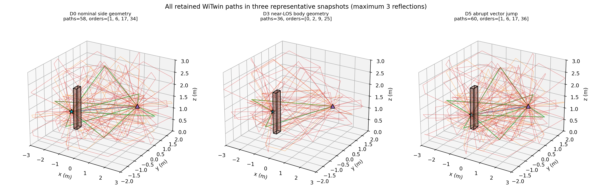
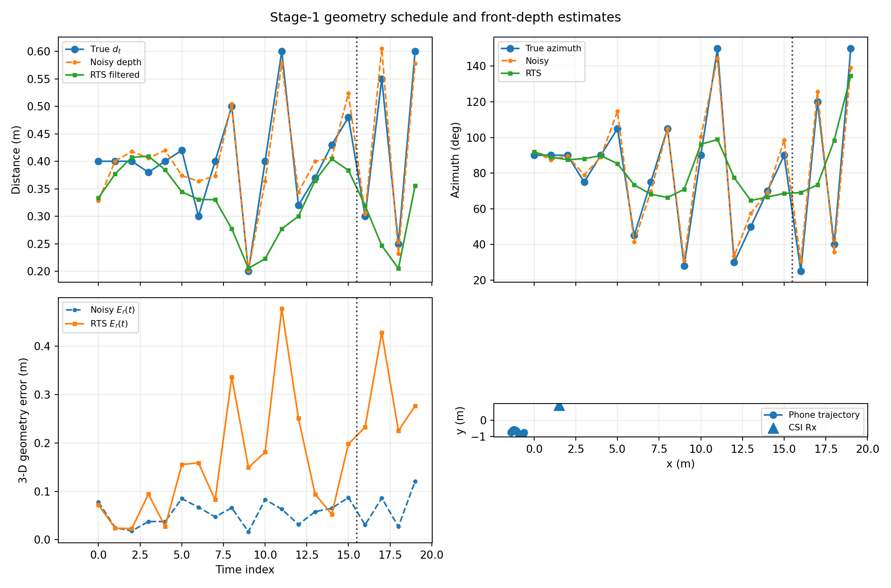

# 阶段 1 `w_geo` 仿真完整配置

## 1. 实验目的和预注册判据

实验直接落实原计划阶段 1 的四个核心问题：动态手机--人体几何是否显著改变复 CSI；忽略 `r_t` 是否把几何误差吸收到静态参数；只有标量距离 `d_t` 是否足够；带噪前置深度、时序处理和协方差边缘化能否优于固定 `r_0`。

运行前固定五条 Go 判据：

1. SIM-B 相对 SIM-C 的测试复 NRMSE 配对差值，其 95% bootstrap 下界大于 0；
2. SIM-E 或 SIM-F 相对 SIM-B 的改善下界大于 0；
3. SIM-C 的平均 `|theta_hat-theta*| < 0.02`；
4. 梯度相对误差小于 `1e-4`，且无噪声参数剖面在真值处有唯一局部/全局极小值；
5. SIM-G 相对 SIM-C 的测试复 NRMSE 差值下界大于 0。

五项必须同时成立才记为阶段 1 `GO`。判据的机器结果见 `outputs/data/summary.json`。

## 2. 变量定义

- `q_t=(p_t,R_t)`：手机 6-DoF 位姿。平移沿房间内部慢速曲线变化；WiTwin 端点接收的欧拉角顺序为 yaw、pitch、roll。
- `r_t`：手机指向人体盒体中心的三维向量。
- `d_t=||r_t||_2`：手机--人体标量距离。
- `theta_ref`：有效的逐反射增益修正参数，真值为 1。
- `beta`：人体代理尺寸和材料等非目标属性，全部固定。

对 WiTwin 在几何 `r` 下给出的逐阶路径基 `H_b(f;r)`，校准模型定义为

```text
H(f; theta_ref, r) = sum_{b=0}^{3} theta_ref^b H_b(f; r)
```

`H_b` 已包含 WiTwin 根据物理材料计算的 Fresnel/传播系数。`theta_ref` 是围绕基准材料的可微有效校正量，不等同于墙体介电常数，也不能被解释为材料表中某个单独物理参数。

## 3. 实验场景：房间里究竟放了什么

### 3.1 坐标系和空间范围

WiTwin 世界坐标采用米。代码构造出的房间内部范围是：

```text
x ∈ [-3.0, 3.0]
y ∈ [-2.0, 2.0]
z ∈ [ 0.0, 3.0]
```

地面为 `z=0`，天花板为 `z=3`。固定 CSI 接收机位于 `(1.50, 0.90, 1.25) m`。手机和人体均在房间内部移动。

相对向量 `r_t` 的定义是“从手机天线参考点指向人体盒体中心”：

```text
body_center_t = tx_position_t + r_t
```

球坐标到三维向量的代码公式为：

```text
r_x = d cos(elevation) cos(azimuth)
r_y = d cos(elevation) sin(azimuth)
r_z = d sin(elevation)
```

因此方位角 0° 指向世界 `+x`，90° 指向 `+y`；正俯仰角指向 `+z`。例如名义几何 `d=0.40 m, azimuth=90°, elevation=0°` 对应 `r_0=(0,0.40,0) m`，即人体中心在手机的 `+y` 方向 40 cm。

### 3.2 房间结构的精确实现

房间不是一个抽象边界框，而是 6 个有 0.10 m 厚度的 WiTwin `Box`：

| 结构   | 中心位置/m           | 尺寸/m                 | 材料参数                     |
| ------ | -------------------- | ---------------------- | ---------------------------- |
| x 负墙 | `(-3.05, 0, 1.50)` | `(0.10, 4.00, 3.00)` | `eps_r=4.0, sigma_e=0.01`  |
| x 正墙 | `( 3.05, 0, 1.50)` | `(0.10, 4.00, 3.00)` | `eps_r=4.0, sigma_e=0.01`  |
| y 负墙 | `(0, -2.05, 1.50)` | `(6.00, 0.10, 3.00)` | `eps_r=4.0, sigma_e=0.01`  |
| y 正墙 | `(0,  2.05, 1.50)` | `(6.00, 0.10, 3.00)` | `eps_r=4.0, sigma_e=0.01`  |
| 地板   | `(0,0,-0.05)`      | `(6.00,4.00,0.10)`   | `eps_r=5.0, sigma_e=0.02`  |
| 天花板 | `(0,0,3.05)`       | `(6.00,4.00,0.10)`   | `eps_r=3.0, sigma_e=0.005` |

每个时刻另加入一个人体盒体，所以每个场景共有 7 个 `Structure`。人体盒体尺寸固定为 `(0.22,0.30,1.70) m`，材料固定为 `eps_r=38.0, sigma_e=1.0 S/m`。盒体始终与世界坐标轴平行；实验只移动其中心，没有模拟人体自身旋转、四肢运动、衣物或体型变化。这些被固定的非目标因素属于 `beta`，也是本实验只能隔离 `w_geo`、不能代表全部 `w_human` 的原因。

### 3.3 手机、接收机和天线

| 项目       | 实际配置                                       |
| ---------- | ---------------------------------------------- |
| 发射端     | 1 个 `phone_tx`，位置和姿态随 `t` 改变     |
| 接收端     | 1 个 `csi_rx`，固定在 `(1.50,0.90,1.25) m` |
| Tx/Rx 阵列 | 都是单天线单元                                 |
| 方向图     | dipole                                         |
| 极化       | `V`，即代码中的垂直极化槽                    |
| Tx 姿态    | 每个时刻传入 yaw、pitch、roll                  |
| Rx 姿态    | 未另行设置，使用零姿态                         |

手机轨迹共有 20 个离散时刻。令 `u=t/19`，代码中的位置和姿态为：

```text
tx_x(t) = -1.40 + 0.80 u
tx_y(t) = -0.75 + 0.18 sin(2 pi u)
tx_z(t) =  1.20 + 0.05 sin(pi u)

yaw(t)   = -22 + 44 u                 degrees
pitch(t) =   9 sin(2 pi u)            degrees
roll(t)  =   7 cos(2 pi u)            degrees
```

这里的 `t` 是归一化离散索引，不是带物理秒数的采样时间；RTS 中使用的步长也是 1 个索引单位。因此当前配置不能把位置差直接解释为 m/s。

### 3.4 无线和路径求解配置

| 项目           | 配置                                                |
| -------------- | --------------------------------------------------- |
| 载频/带宽      | 2.4 GHz / 20 MHz                                    |
| 子载波         | 64 个等间隔频点，即 2.39--2.41 GHz                  |
| 反射上限       | `max_bounces=3`（代码硬断言）                     |
| 主实验射线样本 | `num_samples=2048`                                |
| 路径上限       | `max_num_paths=192`                               |
| 绕射           | `max_diffraction_order=0`                         |
| 返回内容       | 复路径系数、时延、交互类型和反射顶点                |
| 反射后端       | `reflection_field_backend="drjit"`，accuracy 模式 |
| 路径贡献门限   | `min_ray_contribution_threshold=0.0`              |

对每个“时刻 × 模型几何”都会新建一个场景并独立调用一次 `wc.path.solve`。求解后，根据每条路径的交互类型统计反射次数，把复 CFR 拆成 `H_0,H_1,H_2,H_3`。在 `theta_ref=1` 时，这四部分之和必须重建 WiTwin 原始 CFR；当前 `solver_audit.json` 记录的最大重建 NRMSE 为 `8.1504e-7`。

本实验共进行了 960 个主体几何求解，分解为：

```text
20 static + 20 true + 20 scalar
+ 5 depth seeds × (20 noisy + 20 filtered + 20×7 marginal sigma points)
= 60 + 5×180
= 960
```

另有 5 个采样收敛求解和 1 个重复确定性求解。主体求解均保留 27--66 条路径，全部 960 个主体场景中的最大三阶路径数为 40，出现在 `noisy_2, t=8`；没有触及 192 条上限。动态真值轨迹自身的最大三阶路径数为 39（`t=8`），两者不要混淆。

### 3.5 三个具体场景例子

| 时刻 | 场景        | 手机位置/m                | 人体中心/m                | 0/1/2/3 阶路径数 | 物理含义                         |
| ---: | ----------- | ------------------------- | ------------------------- | ---------------- | -------------------------------- |
|    0 | D0 名义侧方 | `(-1.400,-0.750,1.200)` | `(-1.400,-0.350,1.200)` | `[1,6,17,34]`  | 有 LOS，人体相对手机位于 +y 侧方 |
|    9 | D3 近 LOS   | `(-1.021,-0.720,1.250)` | `(-0.847,-0.628,1.215)` | `[0,2,9,25]`   | 人体进入直达线附近，LOS 消失     |
|   17 | D5 跳变     | `(-0.684,-0.861,1.216)` | `(-0.957,-0.389,1.293)` | `[1,6,17,36]`  | 距离和方向同时突变，LOS 恢复     |



人体盒体横截面和短距离组合可能使不受约束的滤波向量把手机放进人体内部。因此所有含噪、滤波和 sigma 点几何均施加相同的物理可行域：手机必须位于水平人体盒体外至少 2 cm。该约束在 CSI 求解前统一执行，不根据结果选择。最终没有零路径快照。

## 4. D0--D5：真实动态几何究竟怎样构造

### 4.1 D0--D5 是轨迹分段，不是六个独立数据集

D0--D5 是同一条 20 时刻真实轨迹 `r_true[t]` 的标签。D0 占时刻 0--2，随后依次进入 D1、D2、D3、D4，最后 D5 占时刻 16--19。所有动态组 SIM-B--SIM-G 使用这同一条真实轨迹来生成观测。

特别需要区分：

- D0 只是动态真值轨迹最前面的 3 个名义时刻；
- SIM-A 则另外构造了一条 20 时刻都使用 `r_0` 的完整控制轨迹；
- 即使 `r_t=r_0`，手机的世界位置和姿态 `q_t` 仍在变化，所以“固定几何”指手机--人体相对向量固定，不代表整个世界场景静止。

### 4.2 每一类扰动的具体含义

| 标签 | 实际设置                                                | 设计目的                                      | 不能怎样解释                       |
| ---- | ------------------------------------------------------- | --------------------------------------------- | ---------------------------------- |
| D0   | 3 个时刻均为 0.40 m、90°、0°                          | 名义相对几何；检查相同 `r_0` 下手机轨迹变化 | 不是手机和人体在世界中完全静止     |
| D1   | 距离 0.38/0.40/0.42 m，同时角度为 75/90/105°、-3/0/3° | 轻微距离扰动加轻微方向扰动                    | 不能把 CSI 差异只归因于 ±2 cm     |
| D2   | 0.30/0.40/0.50 m，方位 45/75/105°，俯仰 -6/0/6°       | 中等距离和方向联合变化                        | 不是纯粹的 ±10 cm 标量实验        |
| D3   | 0.20/0.40/0.60 m，覆盖 28/90/150°                      | 压测近 LOS、侧方和背向路径切换                | 不是只研究极端距离                 |
| D4   | 4 帧从 0.32 m/30°渐变到 0.48 m/90°                    | 慢变化代理，用于训练时序模型                  | 只是半段平滑过渡，不是完整周期波形 |
| D5   | 0.30→0.55→0.25→0.60 m，方向同时跳变                  | 留出测试换手/姿态调整                         | 没有参与 `theta_ref` 训练        |

D1--D3 把原计划的标量距离档位和三维增强合并在同一轨迹里。这能检验综合 `w_geo`，但不能从现有结果中单独估计“只有 2 cm 距离误差”的因果效应；若论文需要距离和方向的独立主效应，应另做固定角度只扫距离、固定距离只扫角度的析因实验。

### 4.3 20 个时刻的精确真值

下表直接由 `outputs/data/trajectory_and_geometry.csv` 生成。`r_true` 是手机坐标参考点到人体中心的向量；人体中心等于该时刻手机位置加 `r_true`。最后一列是动态真值场景实际保留的总路径数。

|  t | 划分 | 标签 |  d/m | 方位/° | 俯仰/° | `r_true=(x,y,z)`/m     | 人体中心 `(x,y,z)`/m    | 路径数 |
| -: | ---- | ---- | ---: | ------: | ------: | ------------------------ | ------------------------- | -----: |
|  0 | 训练 | D0   | 0.40 |      90 |       0 | `(0.000,0.400,0.000)`  | `(-1.400,-0.350,1.200)` |     58 |
|  1 | 训练 | D0   | 0.40 |      90 |       0 | `(0.000,0.400,0.000)`  | `(-1.358,-0.292,1.208)` |     59 |
|  2 | 训练 | D0   | 0.40 |      90 |       0 | `(0.000,0.400,0.000)`  | `(-1.316,-0.239,1.216)` |     59 |
|  3 | 训练 | D1   | 0.38 |      75 |      -3 | `(0.098,0.367,-0.020)` | `(-1.175,-0.233,1.204)` |     57 |
|  4 | 训练 | D1   | 0.40 |      90 |       0 | `(0.000,0.400,0.000)`  | `(-1.232,-0.176,1.231)` |     60 |
|  5 | 训练 | D1   | 0.42 |     105 |       3 | `(-0.109,0.405,0.022)` | `(-1.298,-0.165,1.259)` |     62 |
|  6 | 训练 | D2   | 0.30 |      45 |      -6 | `(0.211,0.211,-0.031)` | `(-0.936,-0.374,1.210)` |     40 |
|  7 | 训练 | D2   | 0.40 |      75 |       0 | `(0.104,0.386,0.000)`  | `(-1.002,-0.231,1.246)` |     57 |
|  8 | 训练 | D2   | 0.50 |     105 |       6 | `(-0.129,0.480,0.052)` | `(-1.192,-0.184,1.301)` |     63 |
|  9 | 训练 | D3   | 0.20 |      28 |     -10 | `(0.174,0.092,-0.035)` | `(-0.847,-0.628,1.215)` |     36 |
| 10 | 训练 | D3   | 0.40 |      90 |       0 | `(0.000,0.400,0.000)`  | `(-0.979,-0.380,1.250)` |     59 |
| 11 | 训练 | D3   | 0.60 |     150 |      10 | `(-0.512,0.295,0.104)` | `(-1.449,-0.540,1.353)` |     58 |
| 12 | 训练 | D4   | 0.32 |      30 |      -6 | `(0.276,0.159,-0.033)` | `(-0.619,-0.723,1.212)` |     42 |
| 13 | 训练 | D4   | 0.37 |      50 |      -2 | `(0.238,0.283,-0.013)` | `(-0.615,-0.632,1.229)` |     47 |
| 14 | 训练 | D4   | 0.43 |      70 |       2 | `(0.147,0.404,0.015)`  | `(-0.664,-0.526,1.252)` |     54 |
| 15 | 训练 | D4   | 0.48 |      90 |       6 | `(0.000,0.477,0.050)`  | `(-0.768,-0.447,1.281)` |     57 |
| 16 | 测试 | D5   | 0.30 |      25 |      -8 | `(0.269,0.126,-0.042)` | `(-0.457,-0.775,1.182)` |     48 |
| 17 | 测试 | D5   | 0.55 |     120 |       8 | `(-0.272,0.472,0.077)` | `(-0.957,-0.389,1.293)` |     60 |
| 18 | 测试 | D5   | 0.25 |      40 |      -5 | `(0.191,0.160,-0.022)` | `(-0.451,-0.648,1.186)` |     42 |
| 19 | 测试 | D5   | 0.60 |     150 |      10 | `(-0.512,0.295,0.104)` | `(-1.112,-0.455,1.304)` |     57 |



### 4.4 训练和测试具体怎样分开

- `t=0..15`：用 D0--D4 的 16 个时刻、每时刻 64 个复子载波估计 `theta_ref`；
- `t=16..19`：固定训练得到的 `theta_hat`，在 D5 的 4 个未见时刻上预测；
- 主测试 NRMSE 与无噪声测试真值比较，不把不可预测的测试测量噪声算成模型误差；
- D5 同时改变距离和方向，所以这里检验的是联合几何突变泛化，不是单变量外推。

## 5. SIM-A--SIM-G：每一组实际怎样运行

### 5.1 “观测几何”和“模型几何”分别是什么意思

“观测几何”不是指算法可以看到真值，而是指用哪一套几何生成合成 CSI 数据。先定义两套无噪声数据：

```text
static clean CSI  = H(theta_ref*=1, r_0 repeated for all 20 times)
dynamic clean CSI = H(theta_ref*=1, r_true[t] from D0--D5)
```

SIM-A 的观测是 `static clean CSI + 独立复高斯噪声`。SIM-B--SIM-G 全部使用同一份 `dynamic clean CSI + 同一配对噪声`；它们只在预测模型拿到的人体几何上不同。这样 B--G 的差异不能归因于观测数据不同。

每次重复都在训练段解同一个问题：

```text
theta_hat = argmin over theta in [0.5,1.5]
            mean over t=0..15 and 64 subcarriers
            |observed_CSI(t,f) - model_CSI(theta, model_geometry_t)|^2
```

随后保持 `theta_hat` 不变，在 `t=16..19` 计算预测，并与对应的无噪声真值比较。

### 5.2 七组的完整数据流

| 组    | 用来生成观测的 CSI                | 预测模型实际放置的人体                                       | 深度种子 | 测试真值      | 该组回答的问题                     |
| ----- | --------------------------------- | ------------------------------------------------------------ | -------: | ------------- | ---------------------------------- |
| SIM-A | 20 时刻均用 `r_0` 的 static CSI | 每时刻 `body=tx_t+r_0`                                     |       无 | static clean  | 模型完全正确时的噪声/优化地板      |
| SIM-B | D0--D5 动态 true CSI              | 仍然每时刻 `body=tx_t+r_0`                                 |       无 | dynamic clean | 忽略动态人体几何会产生多大偏差     |
| SIM-C | D0--D5 动态 true CSI              | `body=tx_t+r_true[t]`                                      |       无 | dynamic clean | 已知真值三维几何时的 oracle 上界   |
| SIM-D | D0--D5 动态 true CSI              | `body=tx_t+z_t^(j)`，即第 j 个含噪三维观测                 |        5 | dynamic clean | 原始前置深度是否已优于固定 `r_0` |
| SIM-E | D0--D5 动态 true CSI              | 第 j 个完整序列经 RTS 后的中心 `r_RTS[t]`                  |        5 | dynamic clean | 常速度离线平滑是否有益             |
| SIM-F | D0--D5 动态 true CSI              | 第 j 个 RTS 后验的 7 个 sigma 点分别求 CFR，再等权平均       |        5 | dynamic clean | 局部几何不确定性传播是否优于单点   |
| SIM-G | D0--D5 动态 true CSI              | `r_scalar[t]=(0,d_true[t],0)`，距离真值但方向恒为 90°/0° |       无 | dynamic clean | 标量距离能否替代三维方向           |

这里的第 `j` 个深度种子由 `j = repeat mod 5` 指定。200 次 CSI 重复按 5 个种子均分，每个种子对应 40 次 CSI 噪声。

### 5.3 各组更具体的理解方式

#### SIM-A：完整 20 时刻理想控制组

SIM-A 不是只取 D0 的 3 个时刻。它重新构造一条 20 时刻控制轨迹：手机仍按 `q_t` 移动和转动，但人体中心始终为 `tx_t+(0,0.40,0)`。观测和模型完全一致，因此其误差主要来自 30 dB CSI 噪声对 `theta_ref` 估计的影响。

#### SIM-B：错误地假设人体一直保持名义相对位置

观测来自真实 D0--D5 动态人体，但模型仍使用 SIM-A 的 `r_0` 路径基。换言之，SIM-B 知道手机每时刻在哪里、姿态是什么、房间和材料是什么，只故意不知道人体相对手机已经移动。B 与 C 的差值是最直接的 `w_geo` 失配效应。

#### SIM-C：动态几何 oracle

观测和预测都使用精确 `r_true[t]`。它不是实际可部署算法，而是回答“如果前置深度完全准确，当前传播模型和参数估计最多能做到多好”。如果 C 仍然很差，就不能把 B 的失败归因于几何信息缺失。

#### SIM-D：模拟有误差的前置深度

对每个真值 `(d,azimuth,elevation)` 分别加入标准差 4 cm、6°、3°的高斯噪声，再转换成三维 `z_t`。距离先截断到 `[0.16,0.70] m`，随后应用人体盒体外 2 cm 的可行域。五个种子都真正重新求解 20 个场景，而不是只在最终 CSI 上加一个近似扰动。

#### SIM-E：离线 RTS 平滑

SIM-E 对每个含噪三维序列做常速度 Kalman 前向滤波和 RTS 后向平滑，再用后验位置中心重建场景。RTS 会使用未来深度帧，因此它是离线参考方法，不是实时手机算法；它不使用真实 `r_t` 或 CSI 测试标签。D5 的突变用于检验常速度先验是否会产生滞后或过度平滑。

#### SIM-F：对几何分布求平均，而不是只用均值

对每个 RTS 后验 `(mean_t,P_t)`，从 `P_t` 的 3 个主轴构造中心点和 3 对正负点，共 7 点。每一点都独立运行三阶 WiTwin，得到 `H_k(theta,t,f)`，然后使用

```text
H_SIM-F(theta,t,f) = (1/7) sum from k=1 to 7 H_k(theta,t,f)
```

这是显式 CFR 边缘化。它只能描述 RTS 均值附近的局部不确定性，不能自动修复一个已经有偏的 RTS 中心。

#### SIM-G：故意给足距离信息，只拿掉方向

SIM-G 使用每个时刻的真值 `d_t`，因此它的标量距离误差理论上为零；但方位恒为 90°、俯仰恒为 0°，即人体始终被放在手机 `+y` 方向。G 与 C 的差异只用于回答“精确距离是否足够”，不能被解释为普通深度传感器的实际性能。

### 5.4 D 标签和 SIM 组之间的关系

可以把两者理解为两个正交维度：

```text
D0--D5：定义真实世界在 t=0..19 怎样变化
SIM-A--SIM-G：定义算法对这个真实世界知道多少几何信息
```

除了 SIM-A 使用单独的 20 时刻 `r_0` 控制数据外，SIM-B--SIM-G 都面对相同的 D0--D5 动态观测。D 标签不是方法，SIM 组也不是新的运动轨迹。

## 6. 噪声、重复和统计

### 6.1 前置深度噪声怎样产生

对于每个真值球坐标，独立生成：

```text
d_noisy  = d_true  + Normal(0, 0.04^2) m
az_noisy = az_true + Normal(0, 6^2) degrees
el_noisy = el_true + Normal(0, 3^2) degrees
```

使用 5 个种子 `20260720`--`20260724`。`d_noisy` 截断到 `[0.16,0.70] m`，然后按第 3.1 节公式转成笛卡尔三维向量。球坐标噪声的对角协方差通过同一个坐标变换的雅可比 `J_t` 一阶传播：

```text
R_t = J_t diag(0.04^2, rad(6)^2, rad(3)^2) J_t^T + 1e-7 I
```

`R_t` 同时作为 RTS 的观测协方差和 SIM-F 的不确定性来源。噪声参数是预先固定的模拟档位，不是从真实手机深度传感器实测标定得到的，因此不能写成某款设备的既有精度。

### 6.2 RTS 的状态模型

状态为 6 维：

```text
x_t = [r_x, r_y, r_z, v_x, v_y, v_z]^T
```

离散步长固定为 1 个时间索引，状态转移和观测矩阵为：

```text
F = [[I3, I3],
     [ 0, I3]]

H = [I3, 0]
```

过程噪声为：

```text
Q = kron([[0.25, 0.5],
          [0.50, 1.0]], I3) × 0.0025
```

初始位置取第一个含噪观测，初始速度为 0；初始位置方差为 `0.02^2 m^2`，速度方差为 `0.08^2`（按归一化步长计）。先完成 Kalman 前向滤波，再做标准 RTS 后向平滑。协方差更新使用 Joseph 形式，后向结果的三维位置块对称化后输出 `P_t`。

该 RTS 覆盖整个 20 时刻序列，因此测试时刻的平滑位置可以使用后续深度观测。它是离线参考，不满足实时因果性；没有使用真实几何或 CSI 标签进行更新。

### 6.3 SIM-F 的 7 个 sigma 点怎样构造

对每个后验位置均值 `m_t` 和协方差 `P_t`：

1. 对 `P_t+1e-9 I` 做特征分解；
2. 构造平方根矩阵 `S=V diag(sqrt(max(lambda,1e-10)))`；
3. 取 `m_t` 本身；
4. 对三个主轴分别取 `m_t ± sqrt(3) S[:,i]`；
5. 对 7 个点都施加相同的人体盒体外 2 cm 可行域；
6. 每点独立求解 WiTwin，最后以 `1/7` 等权平均复 CFR。

这里采用的是确定性的局部 sigma 点平均。它没有使用标准 UKF 中依赖超参数的中心/侧点权重，也不是大量随机 Monte Carlo；文档和结论只把它称为“7 点协方差边缘化”。

### 6.4 CSI 噪声和配对重复

分别计算 static clean CSI 和 dynamic clean CSI 的全局平均功率 `P_signal`。30 dB SNR 对应 `SNR_linear=1000`，复高斯噪声的实部和虚部标准差均为：

```text
sigma_component = sqrt(P_signal / (2 × 1000))
```

SIM-A 使用基于 static 功率生成的噪声；SIM-B--SIM-G 使用基于 dynamic 功率生成的同一配对噪声数组。随机种子为 `20260721`。

总计 200 次 CSI 重复。对于 D/E/F，重复编号 `0,5,10,...` 使用深度种子 0，编号 `1,6,11,...` 使用种子 1，以此类推，所以每个深度种子正好出现 40 次。A/B/C/G 没有深度随机性，但仍使用对应的 200 次 CSI 噪声估计 `theta_ref`。

### 6.5 `theta_ref` 训练

每个组、每次重复都独立估计一个 `theta_hat`。参数范围固定为 `[0.5,1.5]`，使用 70 轮有界黄金分割搜索；目标是训练段 16×64 个复数残差的平均平方模。

因为只有一个参数，黄金分割不依赖随机初始化。另用 2001 点无噪声损失剖面确认 oracle 模型在 `theta=1` 处有唯一极小值，并用中心有限差分验证自动梯度。

### 6.6 汇总和 bootstrap

- 组内报告 200 次结果的均值、标准差和 2.5%--97.5% 分位数；
- 组间先按同一重复编号计算 NRMSE 差，再用种子 `20260722` 做 10,000 次配对 bootstrap；
- 当前 bootstrap 以 200 个重复为重采样单位，其中每 40 次共享一个深度种子，因此区间是当前五种子设计内的条件性区间，不是任意深度传感器总体的置信区间；
- 若后续增加更多深度种子，应改用按深度种子分层或聚类的 bootstrap。

## 7. 指标

### 7.1 主测试指标

对每次重复，只在 `t=16..19` 的 D5 测试段计算：

```text
complex NRMSE = sqrt(
    sum |H_pred - H_clean_truth|^2
    / sum |H_clean_truth|^2
)
```

求和覆盖 4×64 个复数。这里使用无噪声 clean truth，是为了测模型及 `theta_hat` 的泛化误差，而不是把测试测量噪声也算入模型误差。

### 7.2 幅度和相位指标

```text
amplitude residual = 20 log10(|H_pred| / |H_truth|)
amplitude RMS      = sqrt(mean(residual^2))

phase residual = angle(H_pred × conj(H_truth))
phase RMS      = degrees(sqrt(mean(phase residual^2)))
```

相位使用包裹到 `[-pi,pi]` 的差值，没有进行跨子载波 unwrap。

### 7.3 几何和参数指标

- `E_theta=|theta_hat-1|`；
- `E_r=mean ||r_est-r_true||_2`，测三维向量误差；
- `E_d=mean(abs(||r_est||_2-||r_true||_2))`，测标量距离误差；
- 参数名义 95% Fisher 区间覆盖率；
- `theta_hat` 命中 0.5/1.5 搜索边界的比例，用于识别边界删失；
- 本轮没有把三维 `P_t` 的 Mahalanobis 覆盖率作为 Go 指标，后续增加深度种子后应单独校准。

### 7.4 求解器审计指标

- 每个快照的 0/1/2/3 阶路径数；
- 最大路径数与 `max_num_paths=192` 的余量；
- `H_0+H_1+H_2+H_3` 重建原始 WiTwin CFR 的 NRMSE；
- 相同场景重复求解的路径数和 CFR 差异；
- `num_samples=256/512/1024/2048/4096` 相对 4096 的收敛结果。

## 8. 固定软件与硬件

- WiTwin Core 0.0.2，源码提交 `897ee1cdee3b4f35fb0db0c153197f5ebfcce21f`。
- WiTwin Channel 0.1.0，源码提交 `86ec9321e1d7e9288c53ddce3beb68631f92f12d`。
- RayD 0.4.0、DrJit 1.3.1、PyTorch 2.10.0+cu128。
- NVIDIA GeForce RTX 4050 Laptop GPU。
- `DRJIT_LIBOPTIX_PATH=/usr/lib/x86_64-linux-gnu/libnvoptix.so.1`。

官方 `/opt/witwin/validate_witwin.py` 在 2026-07-20 再次通过确定性信道和 LOS/CIR/CFR，但仍把“当前固定组合未验证 `max_bounces>0` 的 reflected path EPC”列为已知限制。本实验成功的是显式指定 `reflection_field_backend="drjit"` 的独立路径求解，不是对 RayD native EPC 的上游兼容性认证；两者不能混为一谈。

## 9. 解释边界

这是受控仿真因果实验，不是现实场景外部效度验证。统计区间覆盖 5 个指定深度噪声种子和 200 次 CSI 噪声重复，不能替代更多房间、人体形状、材料、设备和真实采集链路的验证。三阶反射是求解上限；未启用绕射、漫散射和无限阶多径。官方验证器仍保留 native reflected EPC 未验证的限制。结论应表述为“在该预注册场景族、固定软件组合和 DrJit 反射后端下成立”。

另外，当前 D1--D5 同时改变距离和方向，适合回答综合动态几何 `w_geo` 是否重要，但不是距离/方位/俯仰的完全析因设计。当前 20 个时刻也没有物理时间戳。因此不能从本实验单独声称“2 cm 距离变化导致某个确定 CSI 数值”，也不能把 RTS 速度解释为真实 m/s。

## 10. 数字证据的来源

本文中的配置和数字均可从以下文件交叉核对：

- `run_experiment.py`：所有常量、轨迹公式、场景构造、SIM 分组和统计实现；
- `outputs/data/trajectory_and_geometry.csv`：20 个时刻的手机位置、姿态、真值、含噪和 RTS 几何；
- `outputs/data/geometry_solve_inventory.csv`：960 个主体求解的逐阶路径计数；
- `outputs/data/runtime.json`：软件版本、GPU、运行时间和核心配置；
- `outputs/data/solver_audit.json`：路径上限、重建误差、重复确定性和采样收敛；
- `outputs/data/group_metrics_repeats.csv`：7 组×200 次的逐次指标；
- `outputs/data/group_summary.csv` 和 `summary.json`：最终汇总与 Go/No-Go 判定。

若本文与代码/CSV 出现不一致，应以已执行的 `run_experiment.py` 和输出数据为准，并修正文档，而不是修改数据去迁就文字。
