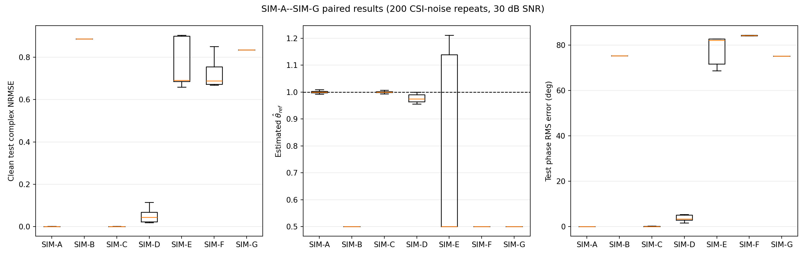
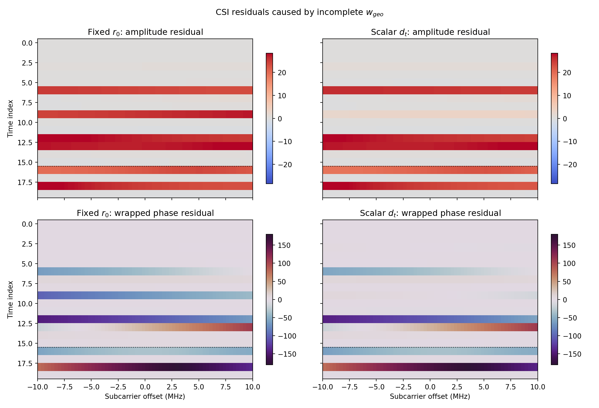
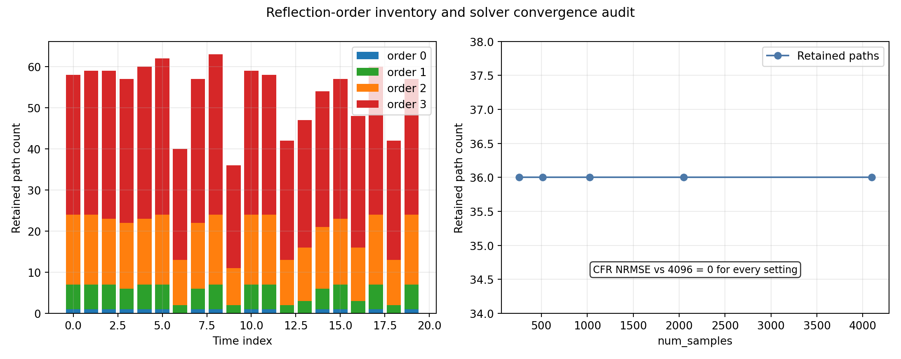
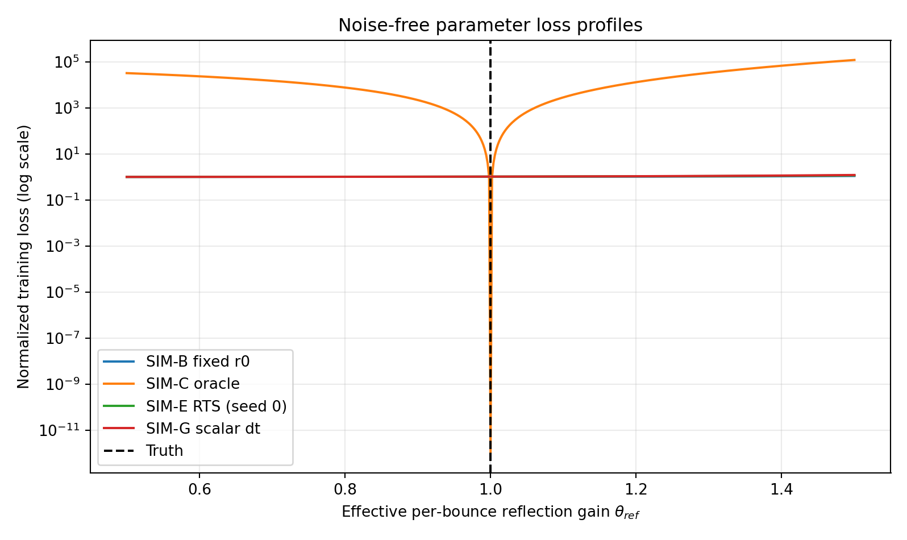

# 阶段 1：`w_geo` 仿真科学假设验证报告

## 结论先行

本次阶段 1 判定为 **GO**，但结论有明确边界：在固定房间、人体盒体、WiTwin 版本、最多三次镜面反射和 2.4 GHz/20 MHz 配置下，动态三维手机--人体几何是复 CSI 的强影响量；把它固定为 `r_0` 会造成巨大的测试误差，并把有效反射参数推到搜索下界。只有真值距离而没有方向的标量模型同样失败。

最关键的数字是：

- 忽略动态几何的 SIM-B 测试复 NRMSE 为 **0.886097**；三维 oracle SIM-C 为 **0.000613**。配对改善为 **0.885484**，95% bootstrap 区间 `[0.885417, 0.885548]`，相对降低 **99.93%**。
- 只有真值距离的 SIM-G NRMSE 为 **0.835232**；相对三维 SIM-C 的配对差为 **0.834619**，95% 区间 `[0.834553, 0.834684]`。因此 `d_t` 几乎无误并不意味着 `r_t` 充分。
- 含噪三维前置深度 SIM-D 的 NRMSE 为 **0.054018**，比 SIM-B 降低 **93.90%**，对应改善区间 `[0.827322, 0.836833]`。
- 常速度 RTS 和其协方差边缘化仍优于固定几何，但在 D5 突变测试段明显过度平滑：SIM-E/F 分别为 **0.767857/0.726841**。这是负结果，不应被写成“滤波必然有益”。

## 1. SIM-A--SIM-G 完整结果

下表汇总 5 个独立深度噪声种子和 200 次配对 CSI 噪声重复。区间是重复分布的 2.5%--97.5% 分位数；主 NRMSE 始终相对无噪声测试真值计算。

| 组 | `theta_hat` 均值±标准差 | `E_theta` | 测试复 NRMSE | NRMSE 95%分位区间 | 幅度 RMS/dB | 相位 RMS/° | theta 区间覆盖率 | theta 下界命中率 |
|---|---:|---:|---:|---:|---:|---:|---:|---:|
| SIM-A | 1.000423 ± 0.003481 | 0.002799 | 0.000489 | 0.000023–0.001280 | 0.002 | 0.022 | 0.930 | 0.000 |
| SIM-B | 0.500000 ± 0.000000 | 0.500000 | 0.886097 | 0.886097–0.886097 | 16.830 | 75.225 | 0.000 | 1.000 |
| SIM-C | 1.000122 ± 0.002942 | 0.002339 | 0.000613 | 0.000036–0.001691 | 0.023 | 0.116 | 0.965 | 0.000 |
| SIM-D | 0.961465 ± 0.040932 | 0.038535 | 0.054018 | 0.019337–0.114985 | 1.698 | 15.865 | 0.195 | 0.000 |
| SIM-E | 0.767572 ± 0.329194 | 0.367572 | 0.767857 | 0.659301–0.903581 | 16.242 | 81.977 | 0.000 | 0.600 |
| SIM-F | 0.500000 ± 0.000000 | 0.500000 | 0.726841 | 0.668006–0.850631 | 18.670 | 83.772 | 0.000 | 1.000 |
| SIM-G | 0.500000 ± 0.000000 | 0.500000 | 0.835232 | 0.835232–0.835232 | 16.461 | 75.171 | 0.000 | 1.000 |

SIM-B/E/F/G 的 `theta_hat` 大量或全部命中 0.5 下界，因此这些组的窄分位区间不是高精度恢复，而是参数被错误几何推到边界后的删失结果。报告同时给出边界命中率就是为了避免这种误读。

## 2. 配对效应证据

| 参考组减候选组 | NRMSE 平均改善 | 95% bootstrap 区间 | 相对改善 | 配对效应 `d_z` |
|---|---:|---:|---:|---:|
| SIM-B − SIM-C | 0.885484 | [0.885417, 0.885548] | 99.93% | 1896.04 |
| SIM-B − SIM-D | 0.832079 | [0.827322, 0.836833] | 93.90% | 23.87 |
| SIM-B − SIM-E | 0.118240 | [0.103037, 0.133183] | 13.34% | 1.08 |
| SIM-B − SIM-F | 0.159256 | [0.149465, 0.168692] | 17.97% | 2.29 |
| SIM-B − SIM-G | 0.050865 | [0.050865, 0.050865] | 5.74% | 边界删失，不解释其大小 |
| SIM-G − SIM-C | 0.834619 | [0.834553, 0.834684] | 99.93% | 1787.12 |
| SIM-E − SIM-F | 0.041016 | [0.033262, 0.049223] | 5.34% | 0.72 |

所有关键 Go 比较的区间下界均大于 0。极大的 `d_z` 出现在 oracle 或参数边界导致组内方差极小的比较中，不能被解释为跨场景总体效应；更稳妥的证据是绝对差值、相对改善和 bootstrap 区间。

## 3. CSI 幅相和空间依赖

下面的热图显示，同一个真值动态轨迹下，固定 `r_0` 和“真值距离 + 固定方向”都会在时间和子载波上产生结构化幅相残差。这不是简单的全频带常数缩放，因此单个静态增益参数不能消除。

三维几何日程同时改变距离、方位和俯仰，并把 D5 突变保留为测试集：

## 4. 三阶反射和数值审计

本实验不是用代理公式替代多径。所有主模型路径基均由 WiTwin 逐场景求解，然后按反射阶数拆成 `H_0`--`H_3`。

| 审计项 | 结果 |
|---|---:|
| 主体几何求解数 | 960 |
| 额外采样/重复审计求解数 | 6 |
| 单快照路径数范围 | 27–66 |
| 单快照三阶路径最大数 | 39 |
| 路径上限及最小余量 | 192；余量 126 |
| 逐阶基重建 WiTwin CFR 最大 NRMSE | `6.1831e-7` |
| 同场景重复路径数 | 36 与 36 |
| 同场景重复 CFR NRMSE | 0.0 |
| 256/512/1024/2048/4096 样本的路径计数 | 均为 `[0,2,9,25]`，总计 36 |
| 各采样数相对 4096 的 CFR NRMSE | 均为 0.0 |
| 实际反射后端 | requested=`drjit`，EPC=`drjit` |

该审计场景人体位于近 LOS，因遮挡没有直达路径，所以阶数计数以 `[0,2,9,25]` 开始于 0 条 LOS。这是几何可见性结果，不是求解失败。960 个主体求解均至少有 27 条有效路径。

需要与官方验证边界区分：`validate_witwin.py` 本次仍把 pinned stack 的 `max_bounces>0` reflected EPC 列为未验证能力。本实验的三阶成功来自显式 DrJit 反射后端，不表示 RayD native EPC 已通过上游组合验证。

下图不是抽取“代表性几条”，而是三个快照中全部保留的有界路径。D0、D3、D5 分别显示 58、36、60 条路径，阶数分布为 `[1,6,17,34]`、`[0,2,9,25]`、`[1,6,17,36]`。

## 5. 参数可微性和可辨识性

- 在 `theta_ref=0.91`，PyTorch 自动微分为 `-1.3774265804e-7`，中心有限差分为 `-1.3774265795e-7`，相对误差 **`7.04e-10`**。
- 2001 点无噪声损失剖面的全局最小值为 **1.000**，局部极小值数量为 **1**，真值处曲率为 **`1.83899e-6`**。
- SIM-C 的平均 `E_theta=0.002339`，名义 95% 区间覆盖率 **96.5%**；这与已知真值一致。

更完整的解释见 [静态参数偏差报告](theta_bias_report.md)。

## 6. Go/No-Go 逐项判定

| 判据 | 数字证据 | 判定 |
|---|---|---|
| 动态几何必须进入模型 | B−C 改善 0.885484，CI 下界 0.885417 | 通过 |
| 合理深度方法优于固定几何 | B−E/F 的 CI 下界分别 0.103037/0.149465 | 通过 |
| oracle 参数偏差 < 0.02 | SIM-C `E_theta=0.002339` | 通过 |
| 梯度和可辨识性 | 相对误差 `7.04e-10`；真值唯一极小 | 通过 |
| 三维向量优于标量距离 | G−C 改善 0.834619，CI 下界 0.834553 | 通过 |

总体判定：**GO**。

## 7. 必须保留的负结果和限制

1. 常速度 RTS 对 D5 距离/方向突变不匹配，测试 `E_r` 从原始深度的 0.05646 m 恶化到 0.28295 m。SIM-E 仍比完全固定 `r_0` 好，但远差于直接使用含噪三维深度。
2. SIM-F 只比 SIM-E 改善 5.34%。围绕一个有偏均值做协方差边缘化不能修复运动模型偏差；下一阶段应试验 jump-aware、IMM 或鲁棒状态模型。
3. 本阶段的 `theta_ref` 是有效逐反射增益，不是墙体介电常数。这里证明的是“几何误差会污染静态有效参数”，还没有证明真实材料参数的无偏恢复。
4. 统计覆盖 5 个深度种子和 200 次 CSI 重复，但场景、人体代理和接收机位置仍是单一受控族；不能把区间外推到任意房间或真实设备。
5. 求解包含 LOS 和最多三次镜面反射，绕射、漫散射和更高阶路径不在本次因果隔离范围内。
6. 官方验证器中的 native reflected EPC 限制仍然保留；本报告只验证这里实际使用的 DrJit 反射执行路径。

## 8. 数据追溯

表格值可在 `outputs/data/group_summary.csv`、`paired_comparisons.csv` 和 `summary.json` 中逐项核对；每次重复在 `group_metrics_repeats.csv`，每个几何求解的 0--3 阶计数在 `geometry_solve_inventory.csv`。完整配置和命令见 [simulation_config.md](simulation_config.md)。
