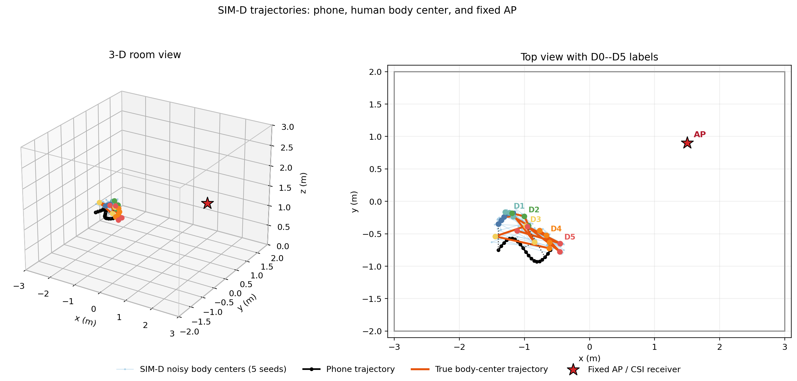
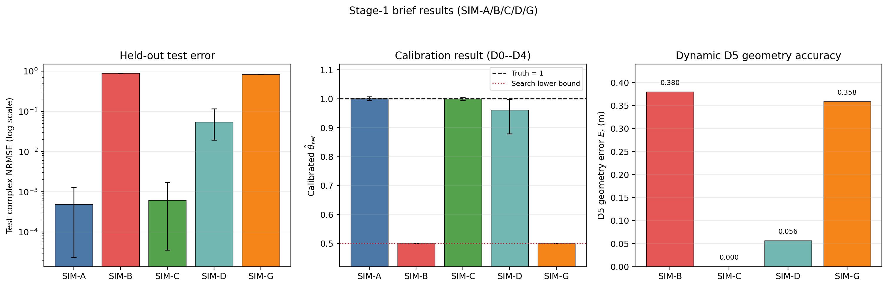

# 阶段 1：`w_geo` 仿真实验简要汇报

## 1. 实验目的

本实验验证一个核心问题：**动态三维手机--人体相对几何是否必须进入复 CSI（channel state information，本文指 64 个子载波上的复数信道频率响应）传播模型。**

记 `r_t` 为时刻 `t` 从手机指向人体中心的三维相对向量，`d_t=||r_t||_2` 为对应的标量距离。本简报只保留 SIM-A/B/C/D/G，比较固定几何、真值三维几何、含噪三维深度和只有真值距离四种几何条件。

## 2. 实验数据流

WiTwin 在相同房间、材料、手机轨迹和接收机配置下求解最多三次反射的传播路径。合成观测和预测使用同一个仿真器，但输入的几何不同：合成观测固定为比较目标，预测端输入待检验的几何假设。

```text
真实或静态人体几何 + theta_ref*=1
                │
                ▼
       WiTwin 生成无噪声复 CSI
                │
      加入 30 dB SNR 的复高斯噪声
                │
                ▼
        前 16 时刻校准 theta_ref
                │
                ▼
       固定 theta_hat，在后 4 时刻预测
                │
                ▼
        与无噪声测试真值比较误差
```

其中 `theta_ref` 是每次反射共享的有效增益修正参数，合成观测采用真值 `theta_ref*=1`，`theta_hat` 是用带噪校准数据估计出的参数值。前 16 个时刻用于校准，后 4 个时刻只用于测试：

- 动态组 SIM-B/C/D/G：D0--D4（`t=0..15`）用于校准，D5（`t=16..19`）用于测试；
- 静态控制组 SIM-A：20 个时刻都使用固定 `r_0=(0,0.40,0) m`，因此其后 4 个时刻不是动态 D5。

本简报保留的五组对照如下：

| 组 | 合成观测 | 预测端使用的人体几何 | 作用 |
|---|---|---|---|
| SIM-A | 静态几何 CSI | 同一静态几何 `r_0` | 正确模型的数值与噪声地板 |
| SIM-B | 动态 D0--D5 CSI | 错误地固定为 `r_0` | 检验忽略动态几何的后果 |
| SIM-C | 动态 D0--D5 CSI | 精确真值 `r_t` | 三维几何 oracle（理想真值）上界 |
| SIM-D | 动态 D0--D5 CSI | 含噪三维深度向量 | 检验现实几何误差下的收益 |
| SIM-G | 动态 D0--D5 CSI | 真值距离 `d_t`，但方向固定 | 检验标量距离是否足够 |

每组使用 200 次 CSI 噪声重复。SIM-B/C/D/G 共用同一批动态合成观测和配对 CSI 噪声，组间只改变预测端的几何输入。SIM-D 额外使用 5 个独立深度噪声种子，距离、方位角和俯仰角噪声标准差分别为 4 cm、6°和 3°。

下图给出三个代表时刻的实际射线追踪场景。青色星形是手机发射端，紫色三角形是固定 AP/CSI 接收端，竖直盒体是人体代理；每个子图画出了该时刻保留的全部 LOS 和一至三阶反射路径，而不是只挑选少数示例路径。D0、D3、D5 分别保留 58、36、60 条路径。


下图进一步展示 SIM-D 的几何数据。黑线是手机轨迹，橙线是人体中心真值轨迹，浅蓝线是 5 个深度噪声种子产生的人体中心观测轨迹，红色星形是固定 AP，其世界坐标为 `(1.50,0.90,1.25) m`。右侧俯视图标出了 D0--D5；灰色虚线给出 `t=0,9,17` 三个代表时刻的手机--人体相对向量。



## 3. 主要实验结果

下表中 `theta_hat` 和参数误差来自前 16 个时刻的校准；测试复 NRMSE（normalized root mean square error，复数归一化均方根误差）、幅度 RMS 和相位 RMS 来自后 4 个时刻。SIM-B/C/D/G 对应动态 D5，SIM-A 对应静态控制轨迹的后 4 个时刻。

| 组 | `theta_hat` 均值±标准差 | `|theta_hat-1|` | 测试复 NRMSE | 幅度 RMS/dB | 相位 RMS/° | `theta_hat=0.5` 命中率 |
|---|---:|---:|---:|---:|---:|---:|
| SIM-A | 1.000423 ± 0.003481 | 0.002799 | 0.000489 | 0.002 | 0.022 | 0% |
| SIM-B | 0.500000 ± 0.000000 | 0.500000 | 0.886097 | 16.830 | 75.225 | 100% |
| SIM-C | 1.000122 ± 0.002942 | 0.002339 | 0.000613 | 0.023 | 0.116 | 0% |
| SIM-D | 0.961465 ± 0.040932 | 0.038535 | 0.054018 | 1.698 | 15.865 | 0% |
| SIM-G | 0.500000 ± 0.000000 | 0.500000 | 0.835232 | 16.461 | 75.171 | 100% |

下图把三类关键结果放在一起：左图为后 4 时刻测试 NRMSE，中图为 D0--D4 校准得到的 `theta_hat`，右图为动态 D5 的三维几何误差。SIM-A 没有动态 D5，因此不进入右图。



关键配对结果为：

| 比较 | 测试 NRMSE 平均降低 | 相对降低 | 95% 配对 bootstrap 区间 |
|---|---:|---:|---:|
| SIM-C 相对 SIM-B | 0.885484 | 99.93% | [0.885417, 0.885548] |
| SIM-D 相对 SIM-B | 0.832079 | 93.90% | [0.827322, 0.836833] |
| SIM-C 相对 SIM-G | 0.834619 | 99.93% | [0.834553, 0.834684] |

几何误差进一步支持上述结果：SIM-D 在 D5 的三维位置平均误差为 **0.05646 m**；固定几何 SIM-B 为 **0.37961 m**。SIM-G 的距离误差约为零（`2.78e-17 m`，浮点舍入量级），但三维向量误差仍为 **0.35840 m**。

下列热图是在 `theta_ref=1` 下直接比较动态真值 CSI 与固定几何/标量距离几何的结果。横轴是子载波频率偏移，纵轴是时刻；黑色虚线分隔 D0--D4 校准段和 D5 测试段。残差随时间和频率呈结构化变化，说明几何错误不是一个全频带常数增益能够消除的。


## 4. 结论分析

1. **动态三维几何是必要输入。** SIM-B 忽略人体相对运动后，D5 测试 NRMSE 达到 0.886097；SIM-C 使用真值三维几何后降至 0.000613，降低 99.93%。
2. **含噪三维深度仍有明显价值。** SIM-D 的深度存在 4 cm/6°/3°噪声，但测试 NRMSE 仍只有 0.054018，比固定几何 SIM-B 降低 93.90%。
3. **只有距离不足以描述传播几何。** SIM-G 的距离几乎完全正确，但 NRMSE 仍为 0.835232。方向错误会改变遮挡、反射点、路径长度和相位，因此 `d_t` 不能替代三维 `r_t`。
4. **错误几何会污染静态参数校准。** SIM-B 和 SIM-G 的 `theta_hat` 全部被推到搜索下界 0.5，而正确几何 SIM-C 能恢复到 1.000122。这表明单一反射增益不能补偿路径和相位层面的几何错误。

综上，阶段 1 支持继续采用动态三维 `w_geo` 作为后续研究主线，当前判定为 **GO**。

## 5. 结论边界

- D0--D5 是一条轨迹的六个分段，不是六组独立实验；当前结果不能分别量化每个分段的独立效应。
- 本实验是同一仿真器内的受控验证，只证明模型内部的因果敏感性，尚不能替代真实设备测量或独立仿真器验证。
- 场景限于单一房间、固定人体盒体、无绕射和最多三次镜面反射。
- 三阶反射由本实验显式使用的 DrJit 后端完成；官方验证器对当前固定版本组合的 native reflected EPC 限制仍然保留。

完整设计、配置和全量结果见 [主实验报告](wgeo_sensitivity_report.md) 与 [实验配置](simulation_config.md)。
