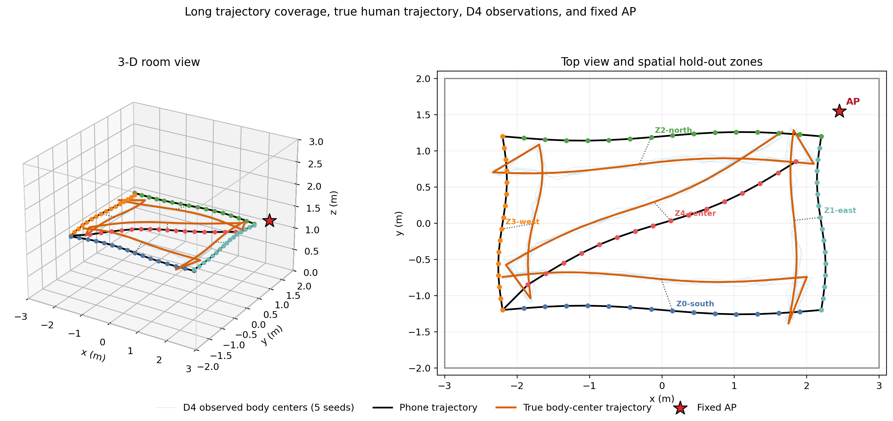
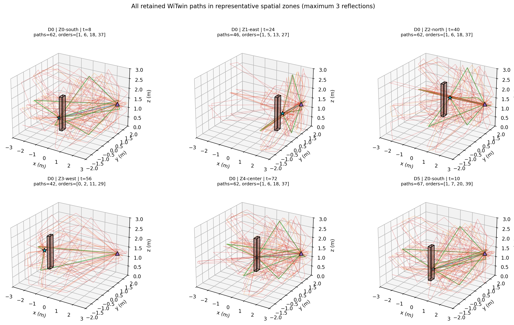
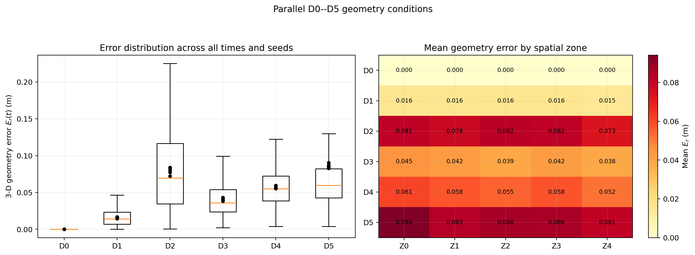
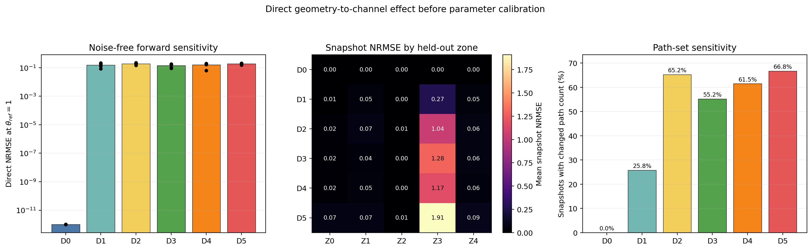
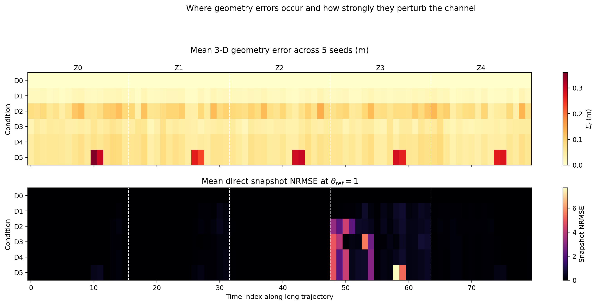
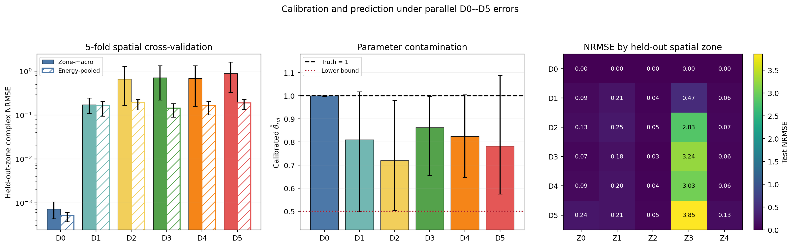

# `w_geo` 长轨迹并行 D0--D5 完整实验报告

## 结论先行

本实验对“动态三维手机--人体几何必须进入复CSI模型”的核心假设判定为 **GO**。80时刻轨迹覆盖5个空间区块，手机和人体中心的二维包围框分别覆盖房间地面包围框的47.44%和49.39%；D0--D5在每个时刻并行施加，因此不再把误差类型与空间位置或时间阶段混杂。

最强证据如下：

- 仅有约1.59 cm平均径向误差的D1，相对精确几何D0的能量合并测试NRMSE增加 **0.163581**，25-cluster配对bootstrap 95%区间为 **[0.093660, 0.206352]**；
- 只有方向误差的D3在距离误差近零时，能量合并NRMSE仍增加 **0.143918 [0.088666, 0.181529]**；
- 联合深度误差D4增加 **0.164415 [0.102792, 0.204210]**；
- 在D4上加入每区块12.5%的两帧异常突发后，D5进一步增加 **0.025205 [0.011505, 0.053484]**；
- 精确几何D0恢复 `theta_hat=1.000068`，平均参数绝对误差仅 **0.001218**；D1--D5的 `theta_hat` 均值降至 **0.720266--0.862989**，说明几何错误被有效反射参数错误吸收；
- D1--D5等权合并的能量合并NRMSE为 **0.172012 [0.124191, 0.202718]**，D0仅为 **0.000515 [0.000369, 0.000608]**。

一个必须保留的未决结果是：D2（10 cm径向噪声）比D1（2 cm）更差的趋势在“区块等权”统计中成立，但能量合并差值区间 **[-0.015467, 0.076408]** 跨零。因此不能把现有数据写成严格单调的误差剂量关系。

## 1. 实验逻辑与数据流

记 `q_t=(p_t,R_t)` 为手机位姿，`r_t` 为从手机指向人体中心的真值三维向量。WiTwin首先用 `r_t` 和有效逐反射增益真值 `theta_ref*=1` 生成公共复CSI真值；随后D0--D5只改变预测端几何：

```text
80时刻真实长轨迹
      │
      ├── 真值几何 + theta_ref*=1 ──> 公共合成观测
      │                                      │
      │                              加入公共配对CSI噪声
      │                                      │
      ├── D0精确几何 ────────────────────────┤
      ├── D1小径向误差 ──────────────────────┤
      ├── D2大径向误差 ──────────────────────┤
      ├── D3仅角度误差 ──────────────────────┤
      ├── D4联合误差 ────────────────────────┤
      └── D5联合误差+突发异常 ───────────────┘
                                             │
                   四个空间区块校准theta_ref，一个完整区块测试
```

这仍是同一个仿真器，但“观测”与“预测”使用不同几何输入。固定 `theta_ref=1` 的直接分析回答几何本身怎样改变CSI；五折空间留一分析进一步回答几何错误怎样污染参数并破坏未见区域预测。完整参数见 [simulation_config.md](simulation_config.md)。

## 2. 长轨迹和仿真场景

手机依次经过南侧、东侧、北侧、西侧和中心对角线5个空间区块，每区块16个时刻；固定AP位于 `(2.45,1.55,1.25) m`。手机在x/y方向跨越 `4.519/2.519 m`，人体中心跨越 `4.431/2.675 m`，显著大于旧实验的局部覆盖。

下图中黑线为手机轨迹，橙线为人体中心真值，浅蓝线为D4的5个几何种子，彩色点标识空间留一区块。灰色虚线连接5个代表时刻的手机与人体。



逐区块链路状态并不相同：

| 区块 | 手机--AP距离/m | 真值CFR总能量 | 路径数范围 | LOS时刻比例 |
|---|---:|---:|---:|---:|
| Z0-south | 2.762--5.402 | `2.1790e-2` | 58--66 | 100% |
| Z1-east | 0.430--2.761 | `3.1921e-1` | 45--59 | 100% |
| Z2-north | 0.431--4.663 | `1.8609e-1` | 58--64 | 100% |
| Z3-west | 4.654--5.402 | `6.9481e-5` | 40--49 | 0% |
| Z4-center | 0.925--4.925 | `6.1632e-2` | 51--66 | 100% |

Z3是刻意保留的远端全NLOS压力区，其总能量比Z1低约4594倍。这解释了为什么区块等权NRMSE会远大于能量合并NRMSE；报告同时给出两者，而不是选择更好看的单一口径。

下图展示5个空间区块的D0真值路径和一个D5异常场景。青色星形是手机，紫色三角形是AP，盒体是人体；图中画出每个快照全部保留的LOS及一至三阶路径。



## 3. D0--D5实际误差是否符合设计

5个几何种子下的实际误差如下。`E_r` 是三维向量平均误差，`E_d` 是距离平均绝对误差；角度列为实际平均绝对误差，不是输入标准差。

| 条件 | 实际 `E_r`/m | 实际 `E_d`/m | 方位误差/° | 俯仰误差/° | 路径计数改变率 |
|---|---:|---:|---:|---:|---:|
| D0 精确几何 | 0.000000 | 0.000000 | 0.000 | 0.000 | 0.00% |
| D1 2 cm径向噪声 | 0.015922 | 0.015922 | 0.000 | 0.000 | 25.75% |
| D2 10 cm径向噪声 | 0.079406 | 0.079406 | 0.000 | 0.001 | 65.25% |
| D3 6°/3°角度噪声 | 0.041220 | 0.000000 | 4.496 | 2.392 | 55.25% |
| D4 4 cm/6°/3°联合噪声 | 0.056748 | 0.031844 | 4.496 | 2.392 | 61.50% |
| D5 D4+异常突发 | 0.086131 | 0.050474 | 7.635 | 3.294 | 66.75% |

D3提供了关键的方向消融：它的距离误差处于浮点舍入量级，但三维误差和路径集合仍明显改变，因此标量距离不能代表完整三维几何。



## 4. 固定 `theta_ref=1` 的直接几何敏感性

这一部分不添加CSI噪声，也不校准参数，直接比较错误几何与真值几何的WiTwin CFR。因此结果不能归因于优化器或 `theta_ref`。

| 条件 | 直接复NRMSE | 幅度RMS/dB | 相位RMS/° | 平均路径数绝对差 |
|---|---:|---:|---:|---:|
| D0 | 0.000000 | 0.000 | 0.000 | 0.000 |
| D1 | 0.155412 | 1.163 | 7.362 | 0.608 |
| D2 | 0.191617 | 3.025 | 15.655 | 2.038 |
| D3 | 0.140684 | 2.865 | 14.747 | 1.735 |
| D4 | 0.157312 | 2.840 | 16.614 | 1.953 |
| D5 | 0.188049 | 4.124 | 24.616 | 2.738 |

即使D1只有约1.6 cm平均径向误差，直接复NRMSE已达到0.155。D3再次说明方向误差在距离完全正确时仍产生0.141直接NRMSE。D5的幅度和相位误差均最大，符合异常突发的设计目的。



时间热图进一步说明：几何误差在5个区块中分布相近，但CSI响应高度依赖空间链路状态；Z3的弱信号NLOS条件将相同量级的几何误差放大成更大的归一化误差。D5每区块局部索引10--11的突发也在上图形成规则的高误差条纹。



## 5. 五折空间留一结果

每折使用4个空间区块的64个时刻校准 `theta_ref`，用完全未参与校准的第5区块16个时刻测试。每折100次CSI噪声重复、5个几何种子，形成每条件500次结果和25个“区块×几何种子”cluster。

### 5.1 两种空间汇总

| 条件 | 区块等权NRMSE | 25-cluster 95% CI | 能量合并NRMSE | 25-cluster 95% CI |
|---|---:|---:|---:|---:|
| D0 | 0.000720 | [0.000436, 0.001053] | 0.000515 | [0.000369, 0.000608] |
| D1 | 0.172288 | [0.107839, 0.245702] | 0.164096 | [0.094757, 0.207445] |
| D2 | 0.665215 | [0.168690, 1.279760] | 0.191831 | [0.132471, 0.227716] |
| D3 | 0.716191 | [0.222637, 1.343858] | 0.144432 | [0.090280, 0.181794] |
| D4 | 0.685412 | [0.160049, 1.332058] | 0.164929 | [0.102058, 0.204818] |
| D5 | 0.895883 | [0.325928, 1.617072] | 0.190135 | [0.133412, 0.231433] |

区块等权口径把Z3与其他区块同权，因而诚实地反映最困难NLOS区域；能量合并口径更接近对整条轨迹复误差能量的总体评价。核心几何效应在两种口径下均存在。



### 5.2 配对cluster证据

差值定义为“候选错误条件NRMSE减参考条件NRMSE”，正值表示错误条件更差。

| 比较 | 区块等权差值 [95% CI] | 正差cluster比例 | 能量合并差值 [95% CI] | 结论 |
|---|---:|---:|---:|---|
| D1−D0 | 0.171568 [0.107993, 0.246434] | 100% | 0.163581 [0.093660, 0.206352] | 小径向误差已可检测 |
| D2−D1 | 0.492927 [0.035775, 1.057688] | 64% | 0.027735 [-0.015467, 0.076408] | 单调性不稳健 |
| D3−D0 | 0.715471 [0.214668, 1.332350] | 100% | 0.143918 [0.088666, 0.181529] | 方向误差显著 |
| D4−D0 | 0.684692 [0.150841, 1.328493] | 100% | 0.164415 [0.102792, 0.204210] | 联合误差显著 |
| D5−D4 | 0.210470 [0.041443, 0.485796] | 92% | 0.025205 [0.011505, 0.053484] | 突发异常进一步恶化 |

这里不把D2−D1包装成确定结论：其区块等权区间为正主要受到Z3影响，而能量合并区间跨零、只有64%的cluster为正。现有5个几何种子不足以证明严格剂量单调性。

## 6. `theta_ref` 参数污染

| 条件 | `theta_hat`均值±标准差 | 平均 `|theta_hat-1|` | 下界命中率 |
|---|---:|---:|---:|
| D0 | 1.000068 ± 0.001532 | 0.001218 | 0.0% |
| D1 | 0.809815 ± 0.171398 | 0.195479 | 4.0% |
| D2 | 0.720266 ± 0.145938 | 0.279734 | 0.2% |
| D3 | 0.862989 ± 0.112539 | 0.137016 | 0.0% |
| D4 | 0.824015 ± 0.123317 | 0.176480 | 0.0% |
| D5 | 0.782506 ± 0.158308 | 0.227254 | 0.0% |

D0证明当前一维校准器在正确几何下能恢复真值。错误几何下所有条件的均值都向下偏，表明优化器通过减弱反射项来部分补偿路径长度、相位、遮挡和路径集合错误；但测试NRMSE仍显著，说明一个全局增益不能替代三维几何。

## 7. 分别分析后再合并

D1--D5五个错误条件等权合并后：

| 汇总方式 | 错误条件合并NRMSE | D0 | 合并减D0 [95% CI] |
|---|---:|---:|---:|
| 区块等权 | 0.626998 [0.210184, 1.134687] | 0.000720 | 0.626278 [0.208707, 1.139734] |
| 能量合并 | 0.172012 [0.124191, 0.202718] | 0.000515 | 0.171497 [0.123745, 0.202165] |

合并结果与D1--D5各自分析方向一致，但它不能替代逐条件表格。这里采用等权只是为了给出透明的科学宏平均，不代表真实传感器中各错误类型的发生概率。

## 8. 路径和数值审计

| 审计项 | 结果 |
|---|---:|
| 主体几何求解 | 2080 |
| 额外审计求解 | 6 |
| 单场景路径数范围 | 25--70 |
| 单场景三阶路径最大数 | 41 |
| 路径上限/最小余量 | 192/122 |
| 逐阶基重建原生CFR最大NRMSE | `6.3282e-7` |
| 同场景重复路径数 | 62/62 |
| 同场景重复CFR NRMSE | 0.0 |
| 实际反射后端 | requested=`drjit`, EPC=`drjit` |

采样审计中，1024、2048和4096样本均得到62条路径及 `[1,6,18,37]` 阶数分布，相对4096样本的CFR NRMSE均为0；256和512样本均为60条路径，相对误差分别为0.001202和0.002974。主实验选择2048样本，没有触及192条路径上限。

最近一次完整强制运行耗时 **209.217秒**，其中主体和审计路径求解 **179.260秒**。原始路径基、逐场景路径数和所有统计重复均保存在 `outputs/data`。

## 9. Go判定与科学结论

核心Go判据要求小径向误差、方向误差、联合误差和突发异常效应在“区块等权”和“能量合并”两种口径的配对cluster-bootstrap下都为正，同时要求D0恢复 `theta_ref`、出现三阶路径且不触及路径上限。7项均通过，因此总体为 **GO**。

本实验支持以下结论：

1. 三维手机--人体几何误差会直接改变复CSI和传播路径集合，影响不是由参数优化器制造的；
2. 厘米级径向误差已经可检测，方向误差即使保持距离完全正确也不可忽略；
3. 几何错误会系统性污染有效反射参数，正确几何是材料或静态参数反演的前提；
4. 短时离群/突发错误在普通联合噪声之上带来额外、两种统计口径均显著的测试损失；
5. 空间链路状态强烈调制几何敏感性，远端全NLOS区域是后续算法必须单独处理的压力场景；
6. 现有数据不支持“径向噪声从2 cm增加到10 cm时，所有空间口径下NRMSE严格单调增加”的强表述。

## 10. 限制与下一步

- 所有观测和预测仍来自同一个仿真器，因此这是内部因果验证，不是现实硬件外部验证；
- 只有一个房间、一个AP、一条确定性长轨迹和一个人体盒体，不能直接外推到任意户型、人体形状或设备；
- 5个几何种子和25个cluster已优于旧实验，但仍不足以精确估计复杂误差分布，特别是D2−D1剂量关系；
- 30 dB CSI噪声和D0--D5误差档位是模拟设置，没有用某款深度设备实测标定；
- 模型包含LOS与最多三次镜面反射，不包含绕射、漫散射或更高阶传播；
- 官方验证器对当前Channel/RayD固定组合的native reflected EPC仍列为未验证。本报告只证明显式DrJit反射执行路径在本实验中成功。

下一步应增加独立轨迹、AP位置和房间布局，并用真实深度/CSI同步数据标定D条件发生概率。统计上应继续以“轨迹或空间区块×几何种子”为独立单元，而不是把相邻帧或重复CSI噪声当作独立空间样本。

## 11. 数据追溯

- 总汇总：`outputs/data/summary.json`；
- 直接敏感性：`direct_sensitivity_by_seed.csv`、`direct_sensitivity_by_time.csv`、`direct_sensitivity_summary.csv`；
- 空间交叉验证：`cv_metrics_repeats.csv`、`cv_cluster_metrics.csv`、`cv_group_summary.csv`、`cv_zone_summary.csv`；
- 配对统计：`paired_cluster_comparisons.csv`、`macro_summary.json`；
- 轨迹与链路：`long_trajectory.csv`、`geometry_conditions.csv`、`zone_link_summary.csv`；
- 求解器证据：`geometry_solve_inventory.csv`、`solver_audit.json`、`selected_paths.json`、`path_basis_cache.npz`。
