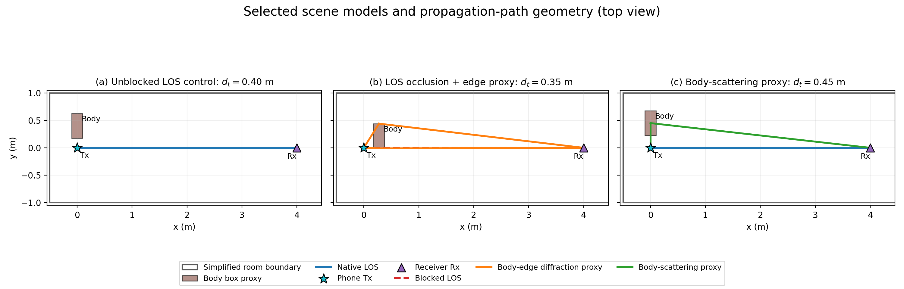
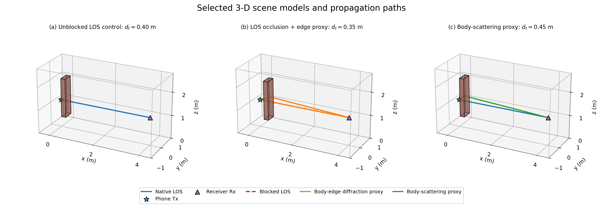
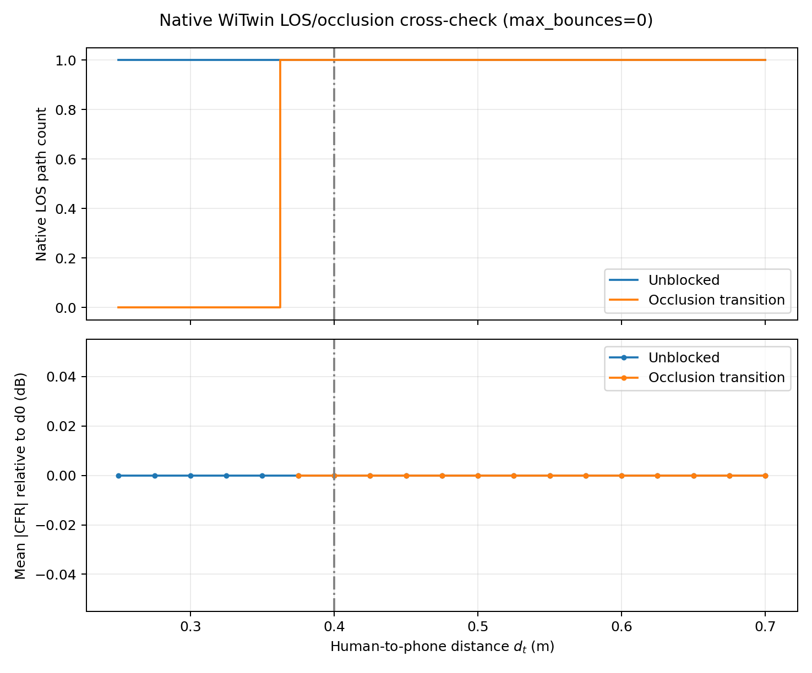
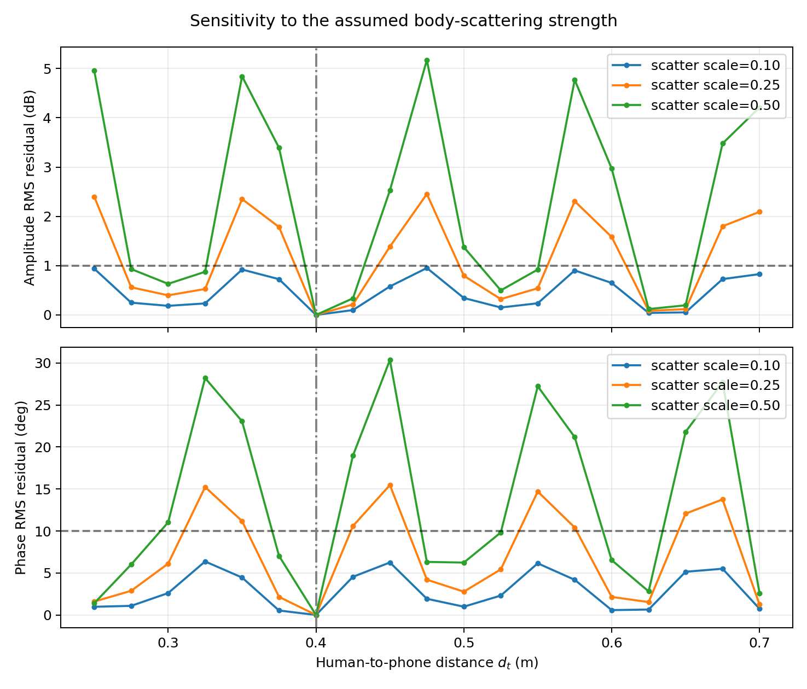
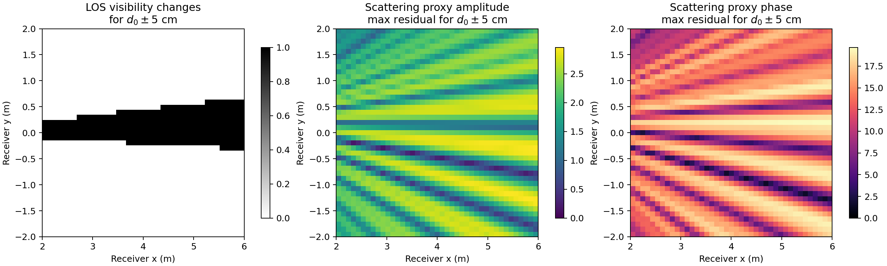
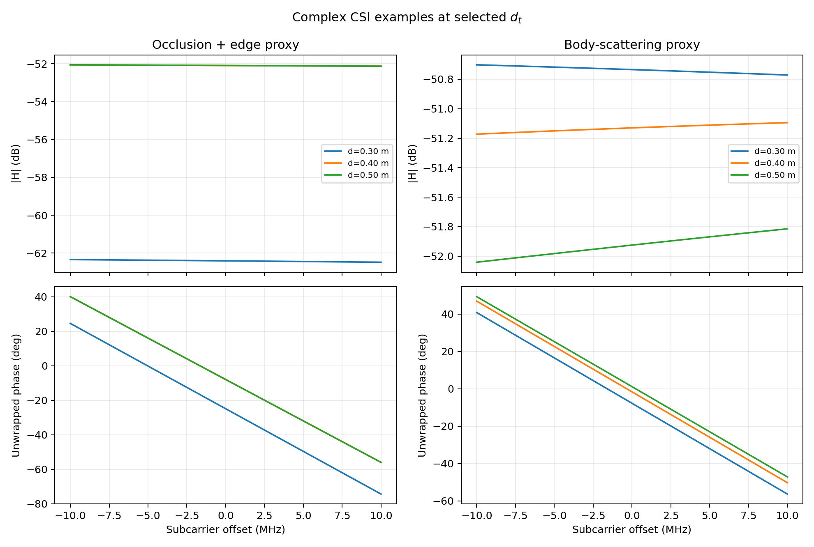
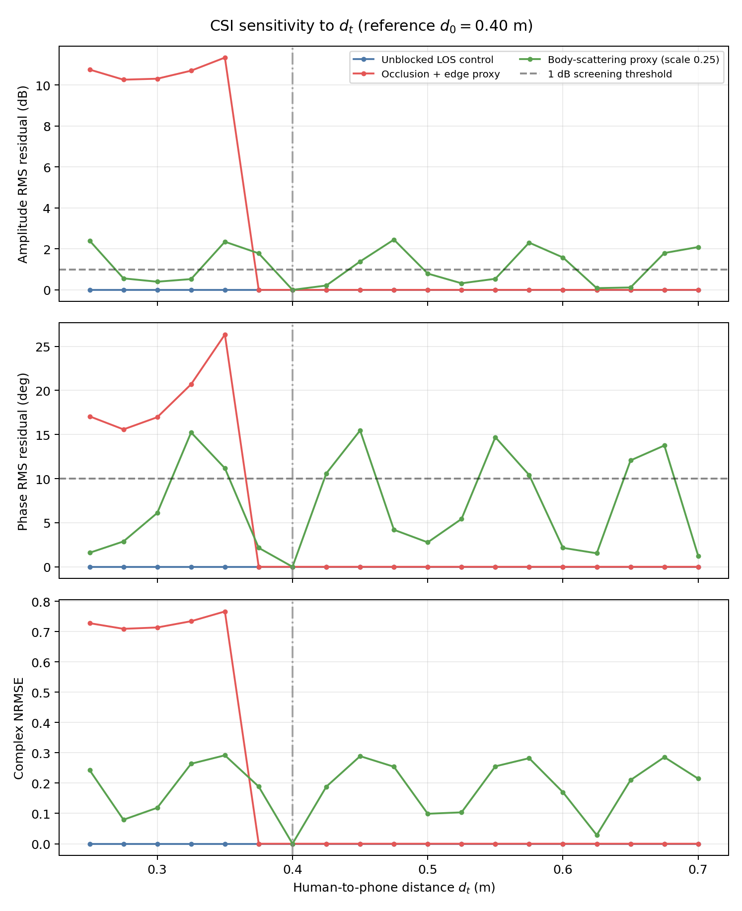

# 4.3 节验证报告：`w_hd` 是否改变 CSI

运行时间：2026-07-15 UTC

## 核心结论

本次筛选实验对 4.3 节假设的结论是：**有条件支持，而不是普遍成立**。

- 当人体移动改变直射路径可见性时，5 cm 的变化就能产生显著且明确的 CSI
  变化。WiTwin 原生结果在 `d_t=0.35 m` 时为零条 LOS 路径，从
  `d_t=0.375 m` 开始恢复为一条 LOS 路径。
- 当人体始终位于直射线之外，且模型中不存在人体相关次级路径时，改变 `d_t`
  对 CSI 的影响精确为零。这是实验所需的负对照。
- 在名义人体散射代理中，`d_0±5 cm` 产生了 `1.39–2.35 dB` 的幅度均方根
  残差和 `11.18–15.47°` 的相位均方根残差，均超过预先声明的筛选阈值
  `1 dB` 或 `10°`。
- 散射结论取决于路径强度。当散射强度为 `0.10` 时，±5 cm 范围内的最大值
  只有 `0.92 dB` 和 `6.25°`，两个阈值都未达到；强度为 `0.25` 和 `0.50`
  时则超过阈值。

因此，可以严谨表述为：

> 当人体移动可能改变 LOS 可见性，或存在强度足够的相干人体相关路径时，
> `w_hd` 值得作为干扰变量继续建模；但不能假设它在所有接收位置和所有人体
> 散射强度下都显著。

该结果支持继续开展更可靠的反射、全波或真实 CSI 验证，但尚不能证明真实人体
近场散射的实际幅度。

## 实际验证内容

固定手机位置为 `(0, 0, 1.2) m`，主接收端位置为 `(4, 0, 1.2) m`。
载波频率为 2.4 GHz，在 20 MHz 带宽内设置 64 个子载波。`d_t` 从 0.25 m
扫描到 0.70 m，间隔 0.025 m；残差参考点为 `d_0=0.40 m`。

实验评估了三种场景：

1. 未遮挡直射路径对照组。
2. 人体跨越 LOS 边界，并使用透明的双边缘绕射代理生成非零遮挡 CSI。
3. 相干单散射代理，人体散射强度分别设置为 0.10、0.25 和 0.50。

前两种场景使用 WiTwin 原生 `path.solve` 和 `max_bounces=0` 进行交叉验证。
第三种场景采用解析模型，因为当前固定的 WiTwin/RayD 组合无法通过一次反射
能力探针。

完整配置和指标定义见 [`simulation_config.md`](simulation_config.md)。

## 代表性场景模型与传播路径

为了直观说明不同结果来自哪一种传播机制，从距离扫描中选取了三个代表性场景：

1. **未遮挡 LOS 对照，`d_t=0.40 m`**：人体位于 Tx–Rx 直射线之外，蓝色
   直线是 WiTwin 原生 LOS。这一场景用于证明只移动一个不参与传播的物体不会
   凭空改变 CSI。
2. **LOS 遮挡，`d_t=0.35 m`**：人体长方体与 Tx–Rx 直射线相交。红色虚线
   表示被阻断的 LOS；橙色折线是用于保持遮挡场景复数 CSI 非零的双边缘绕射
   代理。WiTwin 原生结果在该距离返回零条 LOS，橙色路径不是当前 WiTwin
   反射或绕射求解器的输出。
3. **人体散射代理，`d_t=0.45 m`**：蓝色为原生 LOS，绿色折线为经过人体
   位置的一条相干散射代理路径。该图用于解释为什么很小的路径长度变化也可能
   通过相位旋转造成非单调 CSI 残差。

俯视图便于检查人体与直射线的平面几何关系：



三维图显示了人体代理的高度、Tx/Rx 高度以及路径所在空间平面：



图中蓝色原生 LOS 与 WiTwin `max_bounces=0` 的验证边界一致；橙色和绿色路径
均明确标记为解析代理，不能解释为当前 WiTwin/RayD 组合已经通过反射或绕射
路径验证。

## 主接收端定量结果

所有残差都相对于 `d_0=0.40 m`。

| 场景 | 距离变化 | 幅度 RMS | 相位 RMS | 复数 NRMSE | 阈值判断 |
|---|---:|---:|---:|---:|---|
| 未遮挡对照 | −5 cm | 0.00 dB | 0.00° | 0.000 | 未达到 |
| 未遮挡对照 | +5 cm | 0.00 dB | 0.00° | 0.000 | 未达到 |
| LOS 遮挡与边缘代理 | −5 cm | 11.35 dB | 26.34° | 0.767 | 达到 |
| LOS 遮挡与边缘代理 | +5 cm | 0.00 dB | 0.00° | 0.000 | 未达到 |
| 散射代理，强度 0.25 | −5 cm | 2.35 dB | 11.18° | 0.292 | 达到 |
| 散射代理，强度 0.25 | +5 cm | 1.39 dB | 15.47° | 0.289 | 达到 |
| 散射代理，强度 0.25 | −10 cm | 0.40 dB | 6.11° | 0.119 | 未达到 |
| 散射代理，强度 0.25 | +10 cm | 0.80 dB | 2.77° | 0.099 | 未达到 |

±10 cm 的残差小于 ±5 cm 并不矛盾。相干多径残差会随路径长度造成的相位旋转
而振荡，因此影响并不随距离单调增加。这也说明：仅根据单个 CSI 快照估计
`d_t` 时可能存在多个候选解。

## WiTwin 原生证据

未遮挡对照组在全部 19 个距离点上都返回一条 LOS 路径。保存数组中所有距离
和子载波之间的最大复数 CFR 差异精确为 `0.0`。

在遮挡切换场景中：

- `d_t = 0.25、0.275、0.30、0.325、0.35 m`：零条 LOS 路径。
- `d_t = 0.375–0.70 m`：一条 LOS 路径。
- 只要 LOS 路径存在，其 CFR 就与未遮挡 CFR 完全相同，最大相对差异为
  `0.0`。

这清楚隔离了 WiTwin 原生结果中的效应：人体在已经验证的 LOS-only 求解器中
改变的是二值几何可见性。当前配置不会添加绕射、透射或反射人体路径。



## 散射强度稳健性

取 `d_0±5 cm` 中响应较大的一个：

| 散射强度 | 幅度 RMS | 相位 RMS | 是否达到任一阈值 |
|---:|---:|---:|---|
| 0.10 | 0.92 dB | 6.25° | 否 |
| 0.25 | 2.35 dB | 15.47° | 是 |
| 0.50 | 4.84 dB | 30.36° | 是 |

因此，该结论在中等和较强代理设置下成立，但在弱散射设置下不成立。真实实验
需要判断人体相关路径更接近 0.10、0.25，还是其他强度。



## 空间显著与不显著位置

空间扫描覆盖 `x∈[2,6] m、y∈[-2,2] m` 内的 1,681 个接收位置。对于
名义散射代理，取 `d_0±5 cm` 两个残差中的较大值：

- 93.22% 的位置超过 1 dB 幅度阈值。
- 80.96% 的位置超过 10° 相位阈值。
- 74.42% 的位置同时超过两个阈值。
- 0.24% 的位置同时低于两个阈值。
- 在遮挡几何中，16.54% 的位置发生 LOS 可见性切换。

显著位置示例：

- `(5.9, −1.3) m`：幅度残差最大，为 `2.96 dB`。
- `(6.0, 0.2) m`：相位残差最大，为 `19.65°`。
- `(4.2, 0.7) m`：幅度 `1.94 dB`、相位 `18.66°`，两个阈值都达到。

不显著位置示例：

- `(2.2, 1.6) m`：`0.93 dB` 和 `9.23°`，两个阈值都未达到。
- `(2.7, 1.9) m`：`0.93 dB` 和 `9.10°`，两个阈值都未达到。
- 幅度绝对最小值出现在 `(2.9, −0.3) m`，为 `0.16 dB`；但在判断该位置
  是否整体不显著前，还必须同时考察相位。

条纹状空间分布是相干相位干涉的预期结果。它支持计划中的要求：必须同时搜索
敏感和不敏感的接收位置，不能只依赖一条链路。



## CSI 曲线与残差曲线

子载波图展示了若干代表性距离下的复数 CFR；残差图汇总了整个距离扫描中的
幅度、相位和复数 NRMSE。





## 反射求解器边界

可复现的一次反射探针返回：

```text
RuntimeError: RayD reflection EPC was required for this path solve, but the
workload is not eligible for scene._rayd_scene.trace_refl_epc_field().
```

因此，本报告**不声称** WiTwin 的 `max_bounces>0` 反射路径已经通过验证。人体
散射曲线是明确标注的几何光学代理，只能证明相干次级路径的条件性敏感度，不能
证明人体近场电磁效应已经得到验证。

## 证据强度与剩余缺口

数据能够可靠支持：

- WiTwin 原生 LOS 可见性会随人体几何关系改变，未遮挡对照中不存在数值漂移。
- 在部分空间配置下，5 cm 的 `d_t` 变化足以跨越 LOS 遮挡边界。
- 如果人体相关相干路径达到中等或较强水平，±5 cm 变化会超过当前筛选阈值。
- 敏感度具有明显空间差异，并且不随 `d_t` 单调变化。

数据尚不能支持：

- 在真实 CSI 噪声下的统计显著性结论；当前实验是确定性的，没有硬件重复测量。
- 经过标定的人体反射或散射强度。
- 当前固定栈中已经验证的 WiTwin 反射路径 EPC。
- `d_t` 可被唯一辨识的结论；残差的振荡性说明可能存在多解，需要在计划
  4.5 节中继续验证。

## 复现方法与产物

运行：

```bash
cd /opt/witwin
export DRJIT_LIBOPTIX_PATH=/usr/lib/x86_64-linux-gnu/libnvoptix.so.1
/opt/witwin/venv/bin/python experiments/whd_4_3/run_experiment.py
```

机器可读证据：

- [`outputs/data/summary.json`](outputs/data/summary.json)：核心汇总指标。
- [`outputs/data/metrics_by_distance.csv`](outputs/data/metrics_by_distance.csv)：
  各距离的残差和路径数。
- [`outputs/data/raw_csi_and_spatial.npz`](outputs/data/raw_csi_and_spatial.npz)：
  复数 CSI 和空间数组。
- [`outputs/data/runtime.json`](outputs/data/runtime.json)：软件包版本、源码版本、
  GPU 和固定配置。
- [`outputs/data/reflection_probe.json`](outputs/data/reflection_probe.json)：
  一次反射失败证据。

下一步最必要的科学工作是修复或替换反射路径求解器并重复散射场景，然后在固定
几何条件下多次采集真实 CSI，用实测噪声分布替代当前工程筛选阈值。
